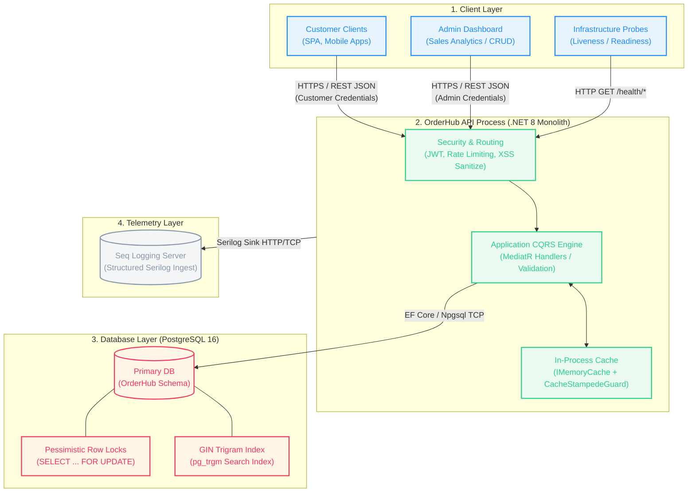

# 1. Introduction and Goals

## 1.1 System Overview

**OrderHub** serves as the central, high-concurrency order management engine for an enterprise e-commerce platform. It provides a robust, secure, and production-ready RESTful backend API designed to handle the critical components of the e-commerce transactional pipeline.

The system is architected as a monolithic Web API following the principles of **Clean Architecture**. By isolating core business logic from database frameworks, web APIs, and authentication mechanisms, OrderHub guarantees high testability, maintainability, and clean separation of concerns.

Key capabilities of OrderHub include:
*   **Product Catalog Management:** Comprehensive CRUD operations, paginated catalog queries, and soft-delete features, optimized with PostgreSQL database indexing and local in-memory caching.
*   **Highly Concurrent Order Lifecycle:** A bulletproof order creation pipeline using **pessimistic locking** at the database layer to completely prevent stock overselling (double-selling) under heavy, concurrent user traffic.
*   **Secure Authentication & Authorization:** Multi-role access control (Admin and Customer) built on JWT access tokens and long-lived database-backed refresh tokens.
*   **Admin Business Intelligence:** High-performance analytical reports for revenue metrics and top-selling products, optimized with cache stampede (thundering herd) guards and version-based cache invalidation.
*   **Operational Observability:** Structured log stream generation via Serilog, featuring PII (Personally Identifiable Information) and sensitive data redaction, pre-integrated with correlation ID tracking.

## 1.2 Business Goals

The primary goal of OrderHub is to provide a reliable, fast, and secure API to power e-commerce clients. The following table describes the business goals and their mapping to architectural strategies:

| ID | Business Goal | Context / Description | Architectural Implementation |
|---|---|---|---|
| **BG-1** | **Inventory Integrity** | Guarantee that stock counts are always correct. Zero financial loss or customer dissatisfaction due to double-selling. | Pessimistic database locks (`FOR UPDATE`) on product records during order validation and stock deduction. |
| **BG-2** | **Flexible Product Catalog** | Allow catalog administrators to manage products without impacting database read performance. | Paginated query handlers, specialized EF Core covering indexes, and case-insensitive GIN Trigram indexing for name searches. |
| **BG-3** | **Secured Transactions** | Prevent unauthorized access to administrative functions and ensure customers can only view/cancel their own orders. | Strict JWT bearer token verification, custom claim-based authorization filters (`owner-or-admin` policy), and rate-limiters. |
| **BG-4** | **Analytical Reporting** | Enable administrators to monitor business health through revenue aggregations and top product reports without degrading operational database performance. | Optimized LINQ aggregation queries combined with an `IMemoryCache` wrapper protected by a `CacheStampedeGuard`. |
| **BG-5** | **XSS & Injection Protection** | Cleanse incoming content to protect database integrity and prevent stored Cross-Site Scripting (XSS) from reaching frontend users. | Automated `SanitizeHtmlEndpointFilter` utilizing a mature `HtmlSanitizer` to scrub all input strings at the API boundary. |
| **BG-6** | **Operational Monitoring** | Provide DevOps teams with the tools to debug, trace, and audit actions, especially during failure conditions. | Structured JSON log generation (Serilog) with trace correlation, hosted readiness probes, and Seq local log aggregator. |

## 1.3 Quality Goals

The system architecture is driven by the following prioritized quality goals:

| Priority | Quality Attribute | Scenario / Goal | Architectural Strategy |
|:---:|---|---|---|
| **P0** | **Transactional Correctness** | Under a concurrent load of 100 checkout requests for a product with 10 units in stock, exactly 10 orders must succeed. 90 must fail gracefully. Stock must be exactly 0. | Database-level row locking via raw SQL query interpolation (`FOR UPDATE`). Isolated transactions wrapped in a Unit of Work. |
| **P0** | **Application Security** | Zero leakage of credentials or PII in application logs. Safe execution of input text containing HTML elements. | Custom Serilog destructuring policy and event filter. HTML sanitization filter on HTTP endpoint parameters. |
| **P0** | **Core Testability** | Ensure changes do not break business logic. Maintain regression-free deployment cycles. | Strict separation of layers, ≥60% unit test coverage in `Application` layer, and integration tests using Testcontainers. |
| **P1** | **Operational Observability** | Trace a request's execution flow end-to-end across multiple threads and services. | Correlation ID middleware injecting trace headers into HTTP headers and Serilog context. |
| **P1** | **Database Scalability** | Maintain API latency under 50ms for read-heavy operations, even with a product catalog containing over 10,000 active SKUs. | Composite covering indexes, read-only tracking disabling (`AsNoTracking`), and version-key caching with stampede protection. |
| **P2** | **Maintainability** | Developers can implement a new API feature or modify business rules without rewriting database access code or endpoint routes. | Clean Architecture directory structures, MediatR command/query dispatching, and FluentValidation behaviors. |

## 1.4 Stakeholders

The following table identifies key stakeholders of this architecture documentation and their corresponding interest areas:

| Stakeholder Role | Primary Interest in Documentation | Relevant Sections |
|---|---|---|
| **Backend Developers** | Code conventions, layer boundaries, dependency injection, caching mechanisms, testing setups, and writing new features. | Sections 4, 5, 6, 8, 12 + ADRs |
| **Frontend/Mobile Developers** | API contracts, request/response formats, authentication flows, error formats (ProblemDetails), and rate limits. | Sections 3, 6, 8 + API Reference |
| **DevOps / SRE** | Container packaging, health check endpoints, environment configurations, migration triggers, logging destinations, and resource limits. | Sections 3, 7, 8, 11 |
| **Product Owners** | Verification of business requirements, project status roadmap, feature limitations, and technical debt constraints. | Sections 1, 2, 11 |
| **Security Architects** | Authentication mechanisms (JWT), password hashing rules, rate-limiting policies, XSS filtering, and logging redaction. | Sections 2, 8, 10 + ADRs |

## 1.5 Project Implementation Roadmap

The implementation of OrderHub is structured across progressive development phases:

*   **Phase 1: Foundation (Completed)**
    *   Setup of Clean Architecture project structure and solution.
    *   User Registration, Login, JWT Authentication, and Refresh Token rotation.
    *   Product catalog CRUD operations with soft-delete and basic pagination.
    *   Serilog logging configuration with Console and File sinks.
*   **Phase 2: Transactions & Analytics (Completed)**
    *   Order creation with PostgreSQL pessimistic locking and stock control.
    *   Status transition controls (Pending -> Confirmed -> Shipped -> Delivered) and order cancellation with stock recovery.
    *   Admin reports (Top-selling products, daily revenue graphs).
    *   Unit testing for commands/queries and integration tests with Testcontainers.
*   **Phase 3: Production Readiness (Current)**
    *   Global Exception Handling mapped to RFC 9457 ProblemDetails.
    *   API Versioning, sliding window Rate Limiting, and Brotli response compression.
    *   XSS prevention via HTML input sanitization filters.
    *   Log scrubbing policy for sensitive parameters and correlation ID middleware.
    *   GIN Trigram indexing for case-insensitive substring product search (up to 10k items).
    *   Cache stampede protection via `CacheStampedeGuard` using key-based `SemaphoreSlim` serialization.
