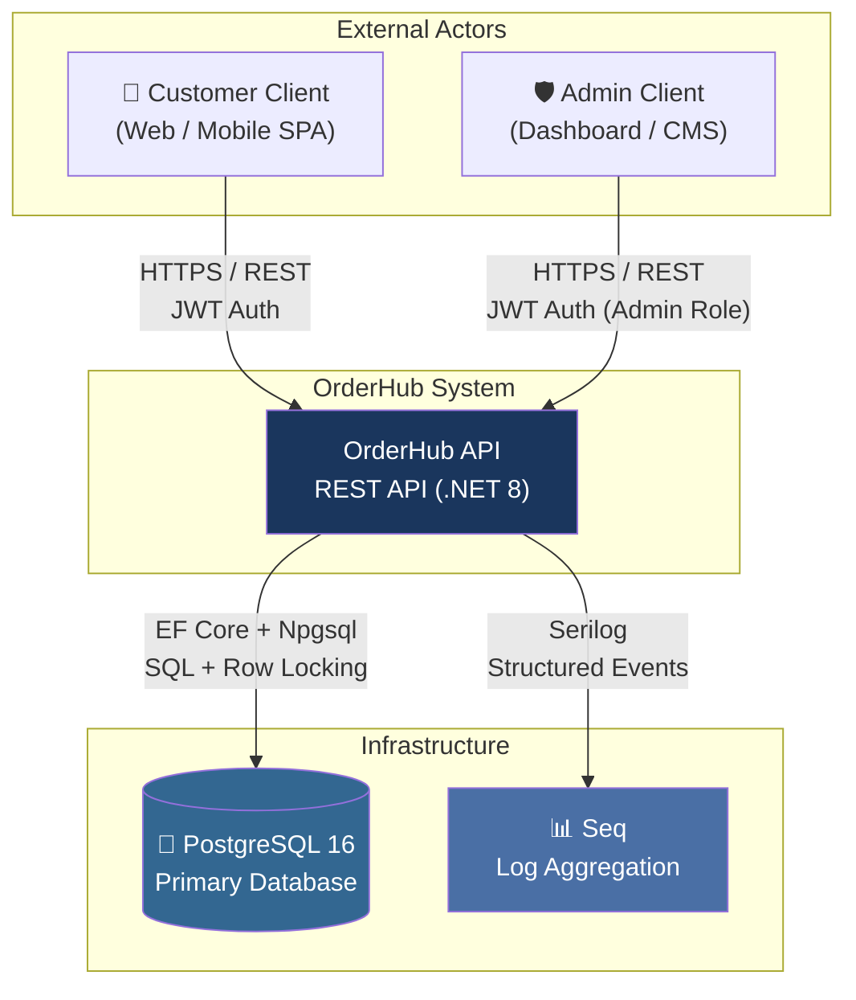

# 3. System Scope and Context

## 3.1 System Boundary

OrderHub is a **backend-only API service**. It has no frontend UI of its own — it serves as the REST API consumed by e-commerce client applications (web, mobile, or desktop).

## 3.2 External Actors

| Actor | Type | Interface | Description |
|-------|------|-----------|-------------|
| **Customer** | Human (via client app) | REST API (HTTPS) | Browses products, creates orders, views order history |
| **Admin** | Human (via dashboard) | REST API (HTTPS) | Manages products, transitions order status, views reports |
| **Health Probes** | System | `GET /health/live`, `GET /health/ready` | Liveness and readiness checks (e.g., Kubernetes, Docker) |

## 3.3 External Systems

| System | Direction | Protocol | Purpose |
|--------|-----------|----------|---------|
| **PostgreSQL 16** | Outbound | TCP (Npgsql) | Primary data store for all entities |
| **Seq** | Outbound | HTTP (Serilog sink) | Structured log ingestion and visualization (Dev only) |

## 3.4 In Scope

- REST API for product, order, and user management
- JWT authentication and role-based authorization
- Pessimistic locking for concurrency-safe order creation
- Admin reporting with cached queries
- Health check endpoints
- Structured logging

## 3.5 Out of Scope

| Item | Notes |
|------|-------|
| Frontend UI | Clients are external consumers of the API |
| Payment processing | No integration with payment gateways (MVP) |
| Email / notifications | No email or push notification service |
| Message queue / Event bus | Outbox pattern planned but not implemented |
| File storage | No image or file upload support |
| Multi-tenancy | Single-tenant system |
| CDN | No static asset serving |
