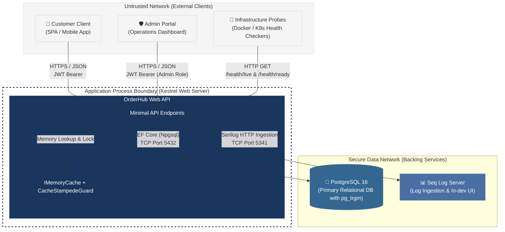

# 3. System Scope and Context

This section defines the operational boundaries of the OrderHub application, highlighting the entities that interact with it (actors) and the external databases and services it relies on (systems).

## 3.1 System Boundary

OrderHub is a **backend-only REST API engine**. It does not serve static web assets (HTML/JS/CSS) or provide user interfaces. Instead, it exposes secure HTTPS endpoints consumed by external client applications.

The database storage and developer telemetry sinks exist outside the application runtime boundary but are deployed within the same container network.

```mermaid
graph TB
    subgraph Clients ["Untrusted Network (External Clients)"]
        Customer["👤 Customer Client<br/>(SPA / Mobile App)"]
        Admin["🛡️ Admin Portal<br/>(Operations Dashboard)"]
        Probes["🤖 Infrastructure Probes<br/>(Docker / K8s Health Checkers)"]
    end

    subgraph Boundary ["Application Process Boundary (Kestrel Web Server)"]
        subgraph API ["OrderHub Web API"]
            Endpoints["Minimal API Endpoints"]
            Cache["IMemoryCache + CacheStampedeGuard"]
        end
    end

    subgraph Storage ["Secure Data Network (Backing Services)"]
        PG[("🐘 PostgreSQL 16<br/>(Primary Relational DB with pg_trgm)")]
        SEQ["📊 Seq Log Server<br/>(Log Ingestion & In-dev UI)"]
    end

    %% Client communication
    Customer -->|"HTTPS / JSON<br/>JWT Bearer"| Endpoints
    Admin -->|"HTTPS / JSON<br/>JWT Bearer (Admin Role)"| Endpoints
    Probes -->|"HTTP GET<br/>/health/live & /health/ready"| Endpoints

    %% Application dependencies
    Endpoints -->|"Memory Lookup & Lock"| Cache
    Endpoints -->|"EF Core (Npgsql)<br/>TCP Port 5432"| PG
    Endpoints -->|"Serilog HTTP Ingestion<br/>TCP Port 5341"| SEQ

    classDef api fill:#1a365d,stroke:#1a365d,color:#fff;
    classDef client fill:#f5f5f5,stroke:#d9d9d9,color:#333;
    classDef storage fill:#336791,stroke:#336791,color:#fff;
    classDef seq fill:#4a6fa5,stroke:#4a6fa5,color:#fff;
    classDef boundary fill:none,stroke:#001529,stroke-width:2px,stroke-dasharray: 5 5;

    class API,Endpoints,Cache api;
    class Customer,Admin,Probes,Clients client;
    class PG storage;
    class SEQ seq;
    class Boundary boundary;
```

## 3.2 External Actors

Actors represent human users or automated system processes that initiate requests into the OrderHub system.

| Actor | Access Role / Policy | Interface & Protocols | Description & Architectural Expectations |
|---|---|---|---|
| **Customer Client** | `Customer` | HTTPS + JSON REST. Requires JWT token authorization in the `Authorization: Bearer <token>` header. | Represents retail shoppers. They authenticate, browse products (using the GIN Trigram-backed search), configure items, place orders, and review/cancel pending orders. |
| **Admin Portal** | `Admin` | HTTPS + JSON REST. Requires JWT token containing the `role: Admin` claim. | Represents internal operational personnel. They perform product inventory management (create/update/delete products), change order processing status, and run sales reports. |
| **Infrastructure Probes** | Anonymous (Unauthenticated) | HTTP GET queries to `/health/live` and `/health/ready` endpoints. | Represents container orchestrators (such as Docker Daemon, Kubernetes, or Uptime monitors) auditing whether the API process is alive and database connections are operational. |

## 3.3 External Systems

External systems are backing services that OrderHub depends on for persistence, caching, and observability.

| System | Protocol & Port | Data Direction | Description & Architecture Impact |
|---|---|---|---|
| **PostgreSQL 16** | TCP on Port `5432` | Bi-directional (Read/Write) | The primary transactional database. Houses user accounts, products, orders, order items, and refresh tokens. Features EF Core index configurations, `pg_trgm` extension for trigrams, and handles pessimistic transactions. |
| **Seq Log Server** | HTTP POST on Port `5341` | Outbound (Write-only) | A structured event logging backend. Serilog sends structured JSON log payloads asynchronously via HTTP. Used during development to inspect API behaviors, SQL execution times, and exceptions. |

## 3.4 Architectural Scope: In-Scope Features

The core capabilities built into the OrderHub monolith include:

1.  **Identity Management:** User registration, password verification (using PBKDF2), role authorization, JWT generation, and refresh token tracking.
2.  **Product Catalog Routing:** Paginated list queries with options for filtering by category, filtering by price range, sorting, and fast case-insensitive name matching via a GIN Trigram index.
3.  **Soft-Deletion Safety:** Soft delete (`IsActive = false`) on products to ensure that historical orders referencing those items do not cause database integrity failures.
4.  **Safe Concurrency Orders:** Thread-safe order creation. Executes product availability verification and stock deduction inside an EF Core transaction protected by row locks (`SELECT ... FOR UPDATE`).
5.  **Multi-Stage Order Lifecycle:** Transitions order states (Pending -> Confirmed -> Shipped -> Delivered). Handles order cancellations, reverting stock changes inside a transaction.
6.  **Thundering Herd Guarded Reports:** Administrative daily revenue graphs and top-selling product summaries. Integrates an in-memory database caching mechanism wrapped in a thread-safe `CacheStampedeGuard`.
7.  **Edge Security Hardening:** Core rate-limiting middleware, HTML sanitization filters on endpoint parameters, NetEscapades security response headers, and structured log sanitization policies.

## 3.5 Architectural Scope: Out-of-Scope Features (System Boundary Exclusions)

To keep the system highly focused, the following capabilities are explicitly handled by external systems or deferred to future project phases:

| Feature Area | Architectural Exclusion Details |
|---|---|
| **User Interface (UI)** | No web panels, mobile screens, or template engines (Razor/Blazor) exist inside the codebase. All UI clients are completely separate applications. |
| **Payment Gateway Integration** | OrderHub does not interface with payment processors (e.g., Stripe, PayPal). Orders are created directly with a payment status assumption. |
| **Message Queue / Event Bus** | The system does not publish events (such as `OrderCreated`) to brokers (e.g., RabbitMQ, Kafka). Distributed notifications are planned for Phase 4 using the Outbox pattern. |
| **Static Asset CDN** | Product image files and static media are not stored or served by the API. Products only store an image URL text pointing to external storage (e.g., AWS S3). |
| **External Authorization Server** | The API issues its own JWT tokens. It does not integrate external OAuth2/OIDC identity providers (such as Keycloak, Auth0, or Entra ID). |
