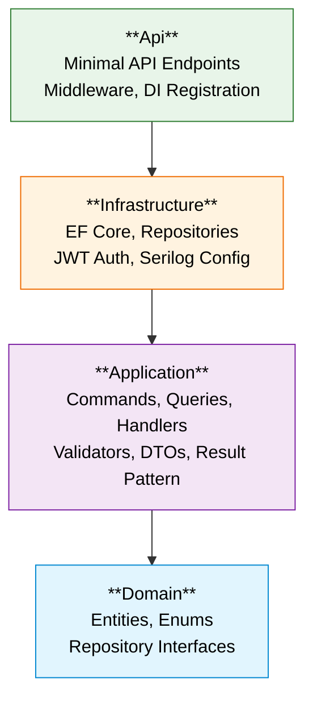
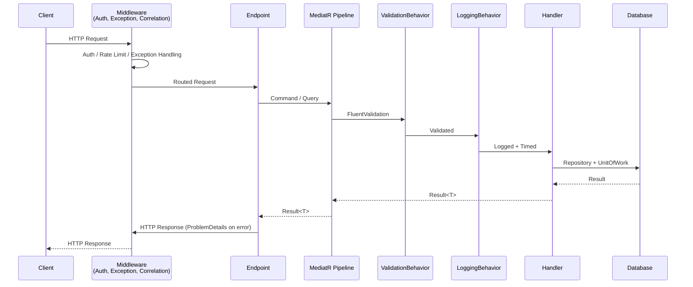

# 4. Solution Strategy

## 4.1 Fundamental Approach

OrderHub follows **Clean Architecture** with strict dependency inversion — each layer only depends on the layer directly below it. The domain is at the center with zero external dependencies, and infrastructure is a plugin that implements application-defined interfaces.

**Dependency rule**: Dependencies point inward only. Domain knows nothing about databases, auth, or HTTP.

## 4.2 Key Patterns

| Pattern | Implementation | Purpose |
|---------|---------------|---------|
| **CQRS** | MediatR commands/queries with pipeline behaviors | Separate read and write paths; cross-cutting concerns via pipeline |
| **Result Pattern** | `Result<T>` return type from handlers | Explicit error handling without exceptions for business failures |
| **Repository + Unit of Work** | Specific interfaces per entity + `IUnitOfWork` | Abstraction over persistence; explicit transaction boundaries |
| **Pessimistic Locking** | `SELECT ... FOR UPDATE` on product rows | Prevent overselling under concurrent order creation |
| **Version-Key Caching** | `IMemoryCache` with prefix-based invalidation | Handler-level caching with atomic version reset on mutations |

## 4.3 Request Processing Pipeline

Every API request flows through a consistent pipeline:

## 4.4 Error Handling Strategy

Two distinct paths, both producing RFC 9457 ProblemDetails:

| Path | Trigger | Handler | Response |
|------|---------|---------|----------|
| **Business errors** | Handler returns `Result<T>.Failure()` | `ResultExtensions` | 4xx ProblemDetails with error code |
| **Validation errors** | FluentValidation fails in pipeline | `ValidationBehavior` → `GlobalExceptionHandler` | 400 ProblemDetails with field details |
| **Unexpected errors** | Unhandled exception | `GlobalExceptionHandler` | 500 ProblemDetails, no stack trace leak |

## 4.5 Technology Selection Rationale

| Choice | Alternative | Why |
|--------|------------|-----|
| PostgreSQL | SQL Server | Open-source, row-level locking, no licensing |
| MediatR | No CQRS | Cross-cutting concerns via pipeline, thin controllers |
| Mapster | AutoMapper | Compile-time code generation, less reflection |
| FluentValidation | Data Annotations | Composable rules, testable validators, DI-friendly |
| IMemoryCache | Redis / Output Cache | Single-instance fit, handler-level control, version-key pattern |
| PasswordHasher\<T\> | BCrypt | Built-in, auto-upgradable hash format, no external dependency |
| Serilog | Microsoft.Extensions.Logging | Structured logging, rich sink ecosystem, sensitive data control |
