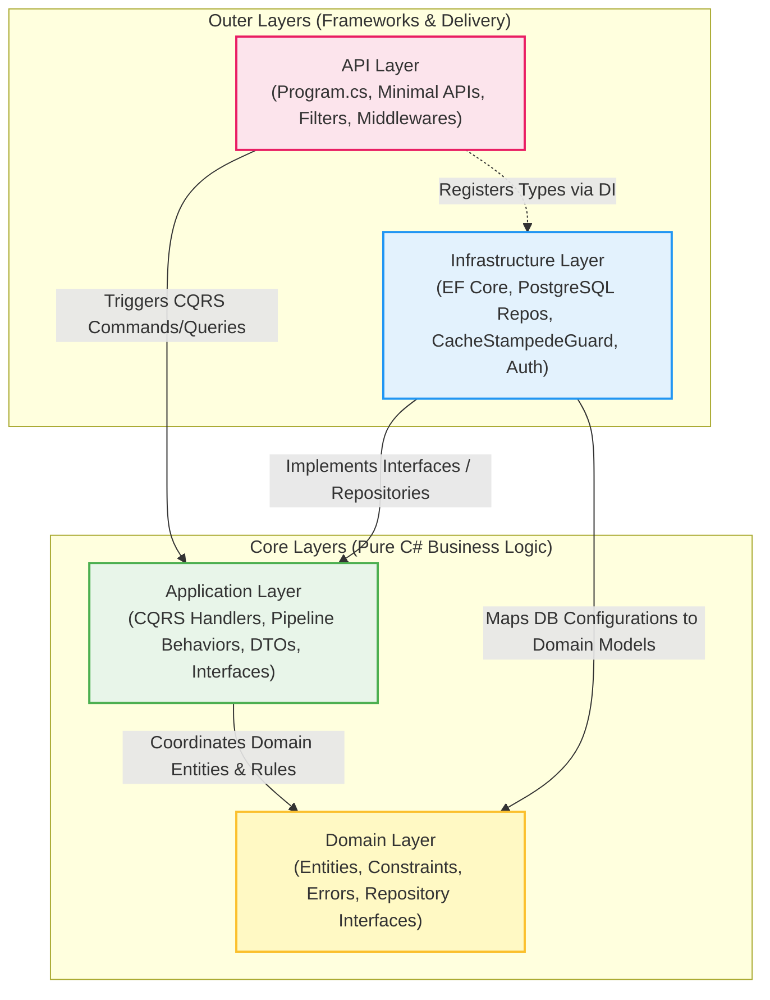
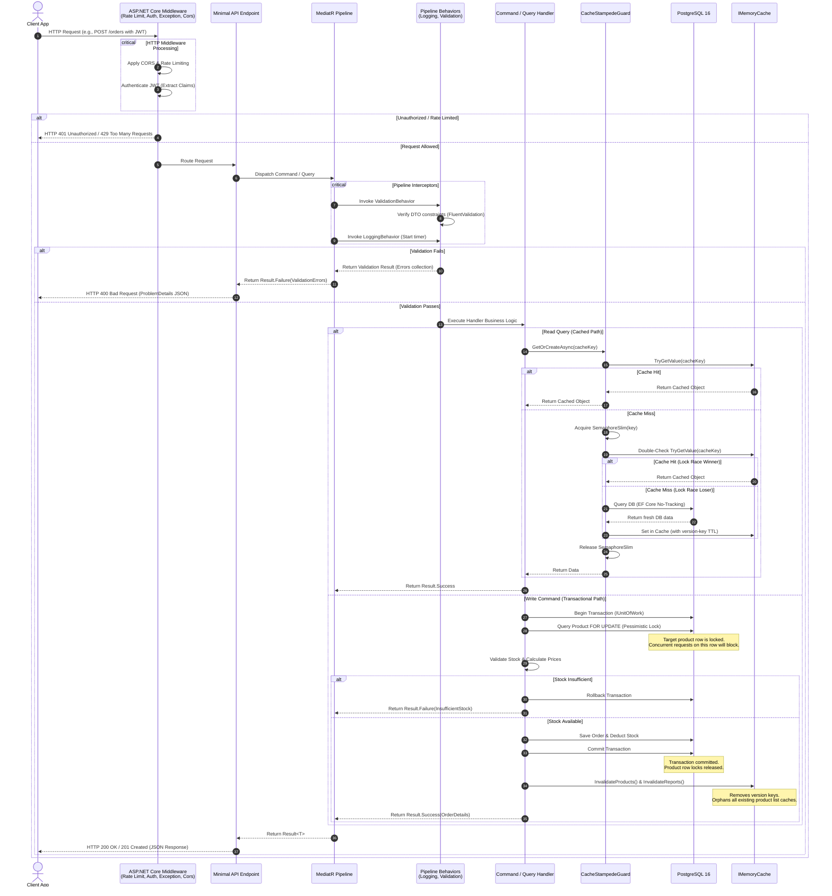

# 4. Solution Strategy

This section describes the strategic design choices, architectural patterns, and execution pipelines that govern how OrderHub achieves its business and quality requirements.

## 4.1 Fundamental Architecture: Clean Architecture

OrderHub implements **Clean Architecture** to maintain a strict separation of business logic from external frameworks, infrastructure, and delivery layers. 

```mermaid
flowchart TD
    %% Styling definitions
    classDef domain fill:#fff9c4,stroke:#fbc02d,stroke-width:2px,color:#333;
    classDef app fill:#e8f5e9,stroke:#4caf50,stroke-width:2px,color:#333;
    classDef infra fill:#e3f2fd,stroke:#2196f3,stroke-width:2px,color:#333;
    classDef api fill:#fce4ec,stroke:#e91e63,stroke-width:2px,color:#333;

    subgraph OuterLayers ["Outer Layers (Frameworks & Delivery)"]
        API["API Layer<br/>(Program.cs, Minimal APIs, Filters, Middlewares)"]:::api
        Infrastructure["Infrastructure Layer<br/>(EF Core, PostgreSQL Repos, CacheStampedeGuard, Auth)"]:::infra
    end

    subgraph CoreLayers ["Core Layers (Pure C# Business Logic)"]
        Application["Application Layer<br/>(CQRS Handlers, Pipeline Behaviors, DTOs, Interfaces)"]:::app
        Domain["Domain Layer<br/>(Entities, Constraints, Errors, Repository Interfaces)"]:::domain
    end

    %% Dependency flows (Strictly inward-pointing)
    API -->|Triggers CQRS Commands/Queries| Application
    API -.->|Registers Types via DI| Infrastructure
    Infrastructure -->|Implements Interfaces / Repositories| Application
    Infrastructure -->|Maps DB Configurations to Domain Models| Domain
    Application -->|Coordinates Domain Entities & Rules| Domain
```

### Key Rules of the Clean Architecture Strategy
1.  **Inward-Pointing Dependencies:** Dependencies point strictly inward. The `Domain` layer sits at the core and has zero reference to other projects or external libraries. The `Application` layer depends only on `Domain`. The `Infrastructure` and `API` projects depend on `Application` and transitively on `Domain`.
2.  **Abstractions and Dependency Inversion:** Application logic coordinates operations using interface contracts (e.g., repository and token generation contracts). The `Infrastructure` layer implements these interfaces. Runtime bindings are resolved in the API layer (`Program.cs`) via ASP.NET Core Dependency Injection.
3.  **Framework Independence:** Database layers (EF Core), logger integrations (Serilog), and API frameworks (Kestrel/Minimal APIs) are treated as pluggable details. This isolation ensures the application can be updated or tested without modifying core business rules.

---

## 4.2 Core Architectural Patterns

| Pattern | Description & Implementation Details | Rationale & Trade-offs |
|---|---|---|
| **CQRS (MediatR)** | Split read operations (Queries) and write operations (Commands) into distinct handler classes. MediatR dispatches requests, passing them through validation and logging behaviors. | Decouples read/write pipelines, optimizes query paths, and centralizes cross-cutting concerns (logging, performance metrics, validation) into pipeline behaviors. |
| **Result Pattern** | Handlers return a union-like structure (`Result<T>`) indicating success with data or failure with a typed `Error` instance. | Replaces throwing exceptions for expected business logic errors (e.g., stock unavailable). This prevents stack trace generation overhead and ensures predictable error reporting. |
| **Pessimistic Locking** | Intercepts EF Core queries to generate SQL `SELECT ... FOR UPDATE` row locks on the Product table during order creation. | Ensures stock count correctness under high concurrent purchase requests. Prevents overselling by blocking concurrent transactions on the same product until the lock-holding transaction commits. |
| **Stampede Guarded Cache** | Wraps in-process memory cache queries with a `CacheStampedeGuard` using `SemaphoreSlim` and double-checked locking per key. | Prevents the **Thundering Herd** (Cache Stampede) issue. When cache entries expire under heavy concurrent load, only one query database worker is allowed to execute, while others wait for the cache to re-populate. |
| **GIN Trigram Search** | Configures a Generalized Inverted Index (GIN) on the `Product.Name` column using PostgreSQL's `pg_trgm` extension and `gin_trgm_ops` operators. | Accelerates `ILIKE '%search%'` substring searches. Prevents database sequence scans, reducing search query times from seconds to milliseconds across thousands of active products. |

---

## 4.3 Pessimistic vs. Optimistic Locking Strategy

For inventory management under concurrency, OrderHub chooses **Pessimistic Locking** over Optimistic Locking.

*   **Optimistic Caching/Locking (Rejected):** Relies on version checks (`concurrency tokens`). If two customers checkout concurrently, the first transaction succeeds and increments the version. The second transaction fails validation on commit, throwing a concurrency exception. Under heavy traffic (e.g., flash sales), this leads to high transaction failure rates, wasted CPU cycles, and requires complex client-side retry logic.
*   **Pessimistic Caching/Locking (Selected):** Acquired via `SELECT ... FOR UPDATE` on product rows. When customer A starts checkout, they lock the product row. If customer B attempts to checkout the same product, their thread is blocked until A's transaction completes (either commits or rolls back).
*   **Consequences:** Ensures 100% stock correctness without transaction failures. Customer requests are serialized at the database layer. Average latency increases slightly under heavy congestion, but the overall throughput remains stable, and user transactions do not fail unless inventory is depleted.

---

## 4.4 Cache Stampede (Thundering Herd) Protection

When a high-traffic cache entry expires, a "thundering herd" of concurrent requests can hit the database simultaneously, causing CPU spikes, database connection starvation, and latency degradation.

OrderHub mitigates this using a thread-safe `CacheStampedeGuard` registered as a Singleton:

1.  **Fast Path:** Check the in-memory cache. If a cache hit occurs, return the data immediately without locking.
2.  **Slow Path (Lock Acquisition):** If a cache miss occurs, retrieve or create a `SemaphoreSlim(1, 1)` mapped specifically to that cache key from a concurrent dictionary.
3.  **Double-Checked Locking:** After acquiring the semaphore lock, check the cache again. If another concurrent thread has already retrieved the data from the database and populated the cache while this thread was waiting, return the cached data immediately and release the lock.
4.  **Database Invocation:** If it is still a cache miss, invoke the database callback, write the result back to `IMemoryCache`, and release the semaphore.

---

## 4.5 Request Execution Lifecycle

The following sequence diagram outlines the path of an HTTP request as it travels through the security, logging, validation, transactional, and database layers of the application:

```mermaid
sequenceDiagram
    autonumber
    actor Client as Client App
    participant Middleware as ASP.NET Core Middleware<br/>(Rate Limit, Auth, Exception, Cors)
    participant Endpoint as Minimal API Endpoint
    participant Pipeline as MediatR Pipeline
    participant Behaviors as Pipeline Behaviors<br/>(Logging, Validation)
    participant Handler as Command / Query Handler
    participant Guard as CacheStampedeGuard
    participant DB as PostgreSQL 16
    participant Cache as IMemoryCache

    Client->>Middleware: HTTP Request (e.g., POST /orders with JWT)
    critical HTTP Middleware Processing
        Middleware->>Middleware: Apply CORS & Rate Limiting
        Middleware->>Middleware: Authenticate JWT (Extract Claims)
    end
    
    alt Unauthorized / Rate Limited
        Middleware-->>Client: HTTP 401 Unauthorized / 429 Too Many Requests
    else Request Allowed
        Middleware->>Endpoint: Route Request
        Endpoint->>Pipeline: Dispatch Command / Query
        
        critical Pipeline Interceptors
            Pipeline->>Behaviors: Invoke ValidationBehavior
            Behaviors->>Behaviors: Verify DTO constraints (FluentValidation)
            Pipeline->>Behaviors: Invoke LoggingBehavior (Start timer)
        end

        alt Validation Fails
            Behaviors-->>Pipeline: Return Validation Result (Errors collection)
            Pipeline-->>Endpoint: Return Result.Failure(ValidationErrors)
            Endpoint-->>Client: HTTP 400 Bad Request (ProblemDetails JSON)
        else Validation Passes
            Behaviors->>Handler: Execute Handler Business Logic
            
            alt Read Query (Cached Path)
                Handler->>Guard: GetOrCreateAsync(cacheKey)
                Guard->>Cache: TryGetValue(cacheKey)
                
                alt Cache Hit
                    Cache-->>Guard: Return Cached Object
                    Guard-->>Handler: Return Cached Object
                else Cache Miss
                    Guard->>Guard: Acquire SemaphoreSlim(key)
                    Guard->>Cache: Double-Check TryGetValue(cacheKey)
                    alt Cache Hit (Lock Race Winner)
                        Cache-->>Guard: Return Cached Object
                    else Cache Miss (Lock Race Loser)
                        Guard->>DB: Query DB (EF Core No-Tracking)
                        DB-->>Guard: Return fresh DB data
                        Guard->>Cache: Set in Cache (with version-key TTL)
                    end
                    Guard->>Guard: Release SemaphoreSlim
                    Guard-->>Handler: Return Data
                end
                Handler-->>Pipeline: Return Result.Success
                
            else Write Command (Transactional Path)
                Handler->>DB: Begin Transaction (IUnitOfWork)
                Handler->>DB: Query Product FOR UPDATE (Pessimistic Lock)
                Note over DB: Target product row is locked.<br/>Concurrent requests on this row will block.
                Handler->>Handler: Validate Stock & Calculate Prices
                
                alt Stock Insufficient
                    Handler->>DB: Rollback Transaction
                    Handler-->>Pipeline: Return Result.Failure(InsufficientStock)
                else Stock Available
                    Handler->>DB: Save Order & Deduct Stock
                    Handler->>DB: Commit Transaction
                    Note over DB: Transaction committed.<br/>Product row locks released.
                    Handler->>Cache: InvalidateProducts() & InvalidateReports()
                    Note over Cache: Removes version keys.<br/>Orphans all existing product list caches.
                    Handler-->>Pipeline: Return Result.Success(OrderDetails)
                end
            end
            
            Pipeline-->>Endpoint: Return Result<T>
            Endpoint-->>Client: HTTP 200 OK / 201 Created (JSON Response)
        end
    end
```

---

## 4.4 Error Handling and Response Architecture

Error responses in OrderHub are normalized at the API boundary. This ensures clients receive a consistent error format regardless of where the failure occurred.

| Error Classification | Triggering Mechanism | Processing Pipeline | Output Format |
|---|---|---|---|
| **Business Failures** | Execution of logic fails validation checks (e.g., `Product NotFound`, `TokenExpired`). | Handlers return `Result.Failure(Error)`. The Endpoint calls `ResultExtensions.ToHttpResult()`. | **HTTP 4xx / 5xx** containing RFC 9457 compliant ProblemDetails JSON with custom error codes. |
| **Validation Failures** | FluentValidation rules fail inside the `ValidationBehavior`. | Pipeline throws a validation exception, which is caught by the `GlobalExceptionHandler` middleware. | **HTTP 400 Bad Request** containing ProblemDetails with a dictionary of validation errors per field. |
| **Infrastructure / Unhandled Failures** | DB connection timeout, SQL syntax error, or unhandled null reference. | The request context escapes the endpoint, triggering the `GlobalExceptionHandler` middleware. | **HTTP 500 Internal Server Error** containing ProblemDetails. Stack trace is logged internally but omitted from the response. |
