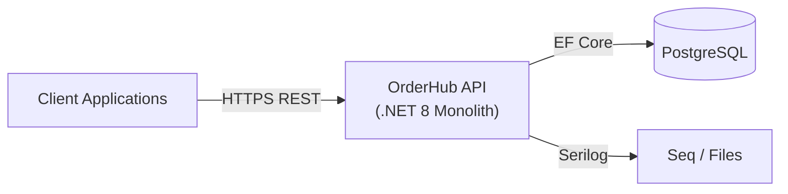
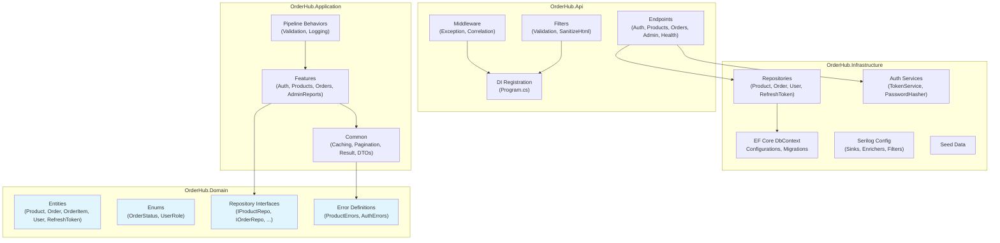

# 5. Building Block View

## 5.1 Level 1 — System Overview

OrderHub is a single deployable unit — a .NET 8 Web API that serves REST endpoints and persists data in PostgreSQL.

## 5.2 Level 2 — Layer Architecture

## 5.3 Level 3 — Building Block Details

### Domain Layer (`OrderHub.Domain`)

Zero external dependencies. Defines the business vocabulary.

| Block | Responsibility |
|-------|---------------|
| **Product** | SKU (unique), Name, Description, Price, Stock, Category, IsActive (soft delete) |
| **Order** | UserId, Status (enum), TotalAmount, CreatedAt, collection of OrderItems |
| **OrderItem** | OrderId, ProductId, Quantity, UnitPrice (snapshot at creation) |
| **User** | Email (unique), PasswordHash, FullName, Role (Admin/Customer) |
| **RefreshToken** | Token, UserId, ExpiresAt, IsRevoked |
| **IProductRepository** | CRUD + filtering + pagination contract |
| **IOrderRepository** | Order with items, user's orders, admin queries |
| **IUserRepository** | Find by email, add user |
| **IRefreshTokenRepository** | Find valid token, revoke |
| **IUnitOfWork** | `SaveChangesAsync()`, `BeginTransactionAsync()`, `CommitAsync()`, `RollbackAsync()` |
| **Result\<T\>** | Success/Failure wrapper with typed `Error` |
| **Error** | Code + Description, typed via static classes (`ProductErrors`, `AuthErrors`, `OrderErrors`) |

### Application Layer (`OrderHub.Application`)

Business logic via CQRS handlers. Depends only on Domain.

| Block | Responsibility |
|-------|---------------|
| **Features/Auth** | Register, Login, Refresh, Logout — commands, handlers, validators |
| **Features/Products** | CRUD — Create, Update, Delete, GetAll, GetById — commands, queries, handlers, validators |
| **Features/Orders** | Create, Cancel, UpdateStatus, GetById, GetMyOrders — commands, queries, handlers, validators |
| **Features/AdminReports** | GetTopProducts, GetRevenueByDay — queries, handlers with caching |
| **Pipeline Behaviors** | `ValidationBehavior` (FluentValidation), `LoggingBehavior` (performance logging) |
| **CacheKeys** | Static class centralizing cache keys and version-based invalidation logic |
| **PagedResult\<T\>** | Pagination response wrapper |
| **Security interfaces** | `IPasswordHasher`, `ITokenService`, `IDateTimeProvider`, `IUserContext` |

### Infrastructure Layer (`OrderHub.Infrastructure`)

Implements Application interfaces. Depends on Application + Domain.

| Block | Responsibility |
|-------|---------------|
| **OrderHubDbContext** | EF Core DbContext with DbSet configurations and connection management |
| **Configurations** | Fluent API entity configs (property constraints, indexes, relationships) |
| **Repositories** | Implementations of `IProductRepository`, `IOrderRepository`, `IUserRepository`, `IRefreshTokenRepository` |
| **UnitOfWork** | Implements `IUnitOfWork` — wraps `SaveChanges`, transaction management |
| **TokenService** | JWT generation (access + refresh), token validation |
| **PasswordHasher** | Wraps ASP.NET Core `PasswordHasher<User>` |
| **DateTimeProvider** | `IDateTimeProvider` implementation for testable time access |
| **UserContext** | `IUserContext` — extracts current user from HTTP context claims |
| **Serilog Config** | Console + File (rolling JSON) + Seq sinks, enrichers, sensitive data policies |
| **SensitiveDataDestructuringPolicy** | Redacts JWT tokens and PII from log output |
| **SensitiveLogEventFilter** | Filters sensitive properties before writing to sinks |
| **Seed Data** | Initial migration seeds admin + customer accounts + 100 products |

### API Layer (`OrderHub.Api`)

HTTP concerns only. Entry point. Depends on Infrastructure (transitively: Application, Domain).

| Block | Responsibility |
|-------|---------------|
| **Program.cs** | DI registration, middleware pipeline, Kestrel config |
| **Endpoints/Auth** | POST register, login, refresh, logout |
| **Endpoints/Products** | GET list/detail, POST create, PUT update, DELETE soft-delete |
| **Endpoints/Orders** | POST create, GET mine/detail, PUT status, POST cancel |
| **Endpoints/AdminReports** | GET top-products, revenue-by-day |
| **Endpoints/Health** | GET liveness, GET readiness (DB check) |
| **GlobalExceptionHandler** | Catches all unhandled exceptions → RFC 9457 ProblemDetails |
| **CorrelationIdMiddleware** | Attaches correlation ID to all requests/responses |
| **SanitizeHtmlEndpointFilter** | Auto-strips HTML from all string properties on request DTOs |
| **ResultExtensions** | Maps `Result<T>` → HTTP responses (200, 201, 400, 404, 409, 403) |
| **EndpointExtensions** | Helper methods for route registration with auth requirements |
