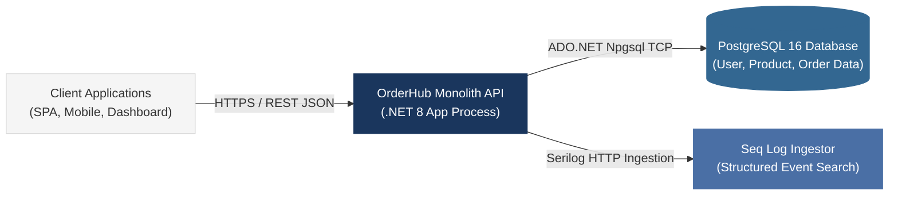
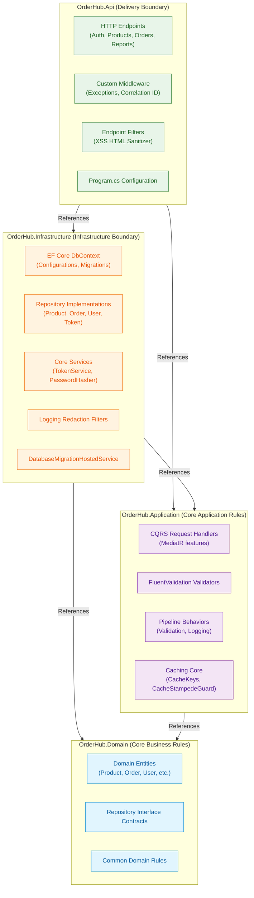
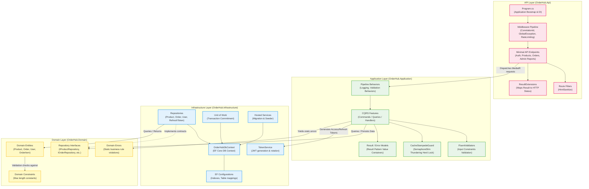

# 5. Building Block View

The Building Block View provides a structural decomposition of the OrderHub system. It shows how the code is organized into architectural layers and components, mapping physical project directories to functional components.

## 5.1 Level 1 — System Context

At the highest level, the OrderHub system is a single execution process (a .NET 8 monolith) connected to external clients and backing services:

```mermaid
graph LR
    Clients["Client Applications<br/>(SPA, Mobile, Dashboard)"] -->|"HTTPS / REST JSON"| API["OrderHub Monolith API<br/>(.NET 8 App Process)"]
    API -->|"ADO.NET Npgsql TCP"| DB[("PostgreSQL 16 Database<br/>(User, Product, Order Data)")]
    API -->|"Serilog HTTP Ingestion"| Seq["Seq Log Ingestor<br/>(Structured Event Search)"]

    classDef default fill:#f5f5f5,stroke:#d9d9d9,color:#333;
    classDef api fill:#1a365d,stroke:#1a365d,color:#fff;
    classDef storage fill:#336791,stroke:#336791,color:#fff;
    classDef seq fill:#4a6fa5,stroke:#4a6fa5,color:#fff;

    class API api;
    class DB storage;
    class Seq seq;
```

---

## 5.2 Level 2 — Layer Architecture (Clean Architecture Decomposition)

OrderHub is partitioned into four logical projects inside the Visual Studio solution (`OrderHub.slnx`). The dependency arrow indicates which project references another. Dependencies point inward:

```mermaid
graph TB
    subgraph API_Project ["OrderHub.Api (Delivery Boundary)"]
        Endpoints["HTTP Endpoints<br/>(Auth, Products, Orders, Reports)"]
        Middleware["Custom Middleware<br/>(Exceptions, Correlation ID)"]
        Filters["Endpoint Filters<br/>(XSS HTML Sanitizer)"]
        Startup["Program.cs Configuration"]
    end

    subgraph Infra_Project ["OrderHub.Infrastructure (Infrastructure Boundary)"]
        DbContext["EF Core DbContext<br/>(Configurations, Migrations)"]
        Repos["Repository Implementations<br/>(Product, Order, User, Token)"]
        Services["Core Services<br/>(TokenService, PasswordHasher)"]
        LogPol["Logging Redaction Filters"]
        BgService["DatabaseMigrationHostedService"]
    end

    subgraph App_Project ["OrderHub.Application (Core Application Rules)"]
        Handlers["CQRS Request Handlers<br/>(MediatR features)"]
        Val["FluentValidation Validators"]
        Behaviors["Pipeline Behaviors<br/>(Validation, Logging)"]
        Caching["Caching Core<br/>(CacheKeys, CacheStampedeGuard)"]
    end

    subgraph Domain_Project ["OrderHub.Domain (Core Business Rules)"]
        Entities["Domain Entities<br/>(Product, Order, User, etc.)"]
        RepoIntf["Repository Interface Contracts"]
        ValueObjects["Common Domain Rules"]
    end

    %% Dependency references
    API_Project -->|"References"| Infra_Project
    API_Project -->|"References"| App_Project
    Infra_Project -->|"References"| App_Project
    Infra_Project -->|"References"| Domain_Project
    App_Project -->|"References"| Domain_Project

    classDef domain fill:#e1f5fe,stroke:#0288d1,color:#01579b;
    classDef app fill:#f3e5f5,stroke:#7b1fa2,color:#4a148c;
    classDef infra fill:#fff3e0,stroke:#ef6c00,color:#e65100;
    classDef api fill:#e8f5e9,stroke:#2e7d32,color:#1b5e20;

    class Entities,RepoIntf,ValueObjects domain;
    class Handlers,Val,Behaviors,Caching app;
    class DbContext,Repos,Services,LogPol,BgService infra;
    class Endpoints,Middleware,Filters,Startup api;
```

---

## 5.3 Level 3 — Component Breakdown by Layer

This section describes the internal details of the building blocks within each layer of the solution.

```mermaid
flowchart TD
    %% Styling definitions
    classDef domain fill:#fff9c4,stroke:#fbc02d,stroke-width:2px,color:#333;
    classDef app fill:#e8f5e9,stroke:#4caf50,stroke-width:2px,color:#333;
    classDef infra fill:#e3f2fd,stroke:#2196f3,stroke-width:2px,color:#333;
    classDef api fill:#fce4ec,stroke:#e91e63,stroke-width:2px,color:#333;

    subgraph API ["API Layer (OrderHub.Api)"]
        Program["Program.cs<br/>(Application Boostrap & DI)"]:::api
        Middleware["Middleware Pipeline<br/>(CorrelationId, GlobalException, RateLimiting)"]:::api
        Endpoints["Minimal API Endpoints<br/>(Auth, Products, Orders, Admin Reports)"]:::api
        Filters["Route Filters<br/>(HtmlSanitize)"]:::api
        ResultExt["ResultExtensions<br/>(Maps Result<T> to HTTP Status)"]:::api
        
        Program --> Middleware
        Middleware --> Endpoints
        Endpoints --> Filters
        Endpoints --> ResultExt
    end

    subgraph Application ["Application Layer (OrderHub.Application)"]
        CQRS["CQRS Features<br/>(Commands / Queries / Handlers)"]:::app
        Validators["FluentValidators<br/>(Input Constraints Validation)"]:::app
        Behaviors["Pipeline Behaviors<br/>(Logging, Validation Behaviors)"]:::app
        CacheGuard["CacheStampedeGuard<br/>(SemaphoreSlim Thundering Herd Lock)"]:::app
        Result["Result / Error Models<br/>(Result Pattern Value Containers)"]:::app
        
        Behaviors --> CQRS
        CQRS --> Validators
        CQRS --> CacheGuard
        CQRS --> Result
    end

    subgraph Infrastructure ["Infrastructure Layer (OrderHub.Infrastructure)"]
        DbContext["OrderHubDbContext<br/>(EF Core DB Context)"]:::infra
        Configs["EF Configurations<br/>(Indexes, Table mappings)"]:::infra
        Repos["Repositories<br/>(Product, Order, User, RefreshToken)"]:::infra
        UoW["Unit of Work<br/>(Transaction Commitment)"]:::infra
        TokenService["TokenService<br/>(JWT generation & rotation)"]:::infra
        Background["Hosted Services<br/>(Migration & Seeder)"]:::infra
        
        DbContext --- Configs
        Repos --> DbContext
        UoW --> DbContext
        Background --> DbContext
    end

    subgraph Domain ["Domain Layer (OrderHub.Domain)"]
        Entities["Domain Entities<br/>(Product, Order, User, OrderItem)"]:::domain
        Constraints["Domain Constraints<br/>(Max length constants)"]:::domain
        Errors["Domain Errors<br/>(Static business rule violations)"]:::domain
        RepoInterfaces["Repository Interfaces<br/>(IProductRepository, IOrderRepository, etc.)"]:::domain
    end

    %% Dependency & Invocation flows
    Endpoints -->|Dispatches MediatR requests| Behaviors
    CQRS -->|Queries / Persists Data| RepoInterfaces
    CQRS -->|Generates Access/Refresh Tokens| TokenService
    Repos -.->|Implements contracts| RepoInterfaces
    Repos -->|Queries / Returns| Entities
    Entities -->|Validation checks against| Constraints
    CQRS -->|Yields static errors| Errors
```

### 5.3.1 Domain Layer (`OrderHub.Domain`)
The Domain layer contains the core database entities, business rules, and interface contracts. It has zero external dependencies and does not refer to databases, HTTP web contexts, or serialization libraries.

*   **Path:** `src/OrderHub.Domain/`
*   **Key Components:**
    *   **BaseEntity:** Abstract class defining the identity (`Id`) and tracking audit properties (`CreatedAt`, `UpdatedAt`) for all database-backed entities.
    *   **Product:** Entity tracking catalog items. Includes `SKU` (unique), `Name`, `Description`, `Price`, `Stock`, `Category`, and `IsActive` (soft-delete flag).
    *   **User:** Represents authenticated accounts. Includes `Email` (unique identifier), `PasswordHash`, `FullName`, and `Role` (Admin or Customer).
    *   **Order:** Manages order transactions. Includes `UserId`, `Status` (enum: Pending, Confirmed, Shipped, Delivered, Cancelled), `TotalAmount`, `CreatedAt`, and a collection of child `OrderItems`.
    *   **OrderItem:** Links products to orders. Includes `ProductId`, `Quantity`, and `UnitPrice` (snapshotted at the time of creation to decouple historical sales from subsequent catalog price changes).
    *   **RefreshToken:** Tracks login sessions. Includes `Token`, `UserId`, `ExpiresAt`, `CreatedAt`, and `RevokedAt` columns to facilitate stateless JWT rotation.
    *   **Interfaces:** Repository interface definitions (`IProductRepository`, `IOrderRepository`, `IUserRepository`, `IRefreshTokenRepository`) and the `IUnitOfWork` contract. This defines how other layers query and write data.
    *   **Domain Errors:** Static error classes (`ProductErrors`, `OrderErrors`, `AuthErrors`) that map domain errors to Result objects.

---

### 5.3.2 Application Layer (`OrderHub.Application`)
The Application layer implements the software's use cases as CQRS command and query handlers. It coordinates domain entities and repositories to execute business flows.

*   **Path:** `src/OrderHub.Application/`
*   **Key Components:**
    *   **CQRS Features (`/Features`):** Organized into folders by feature (Auth, Products, Orders, AdminReports). Each directory contains:
        *   *Command/Query:* The request DTO (e.g., `CreateOrderCommand` implementing `ICommand<T>`).
        *   *Validator:* FluentValidation rules (e.g., `CreateOrderCommandValidator` verifying quantity and parameter formats).
        *   *Handler:* Executes the transaction logic (e.g., `CreateOrderCommandHandler`).
    *   **Caching Engine (`/Common/Caching`):**
        *   `CacheKeys`: A static class centralizing cache key patterns and the version-key prefix eviction methods.
        *   `CacheStampedeGuard`: A Singleton component that uses `SemaphoreSlim` double-checked locks per key to prevent the thundering herd problem.
    *   **Pipeline Behaviors (`/Common/Behaviors`):**
        *   `ValidationBehavior`: Intercepts MediatR commands, runs matching FluentValidation validators, and short-circuits execution with a ProblemDetails response if constraints fail.
        *   `LoggingBehavior`: Wraps request execution inside structured logs, monitoring query/command latencies and outputting warning indicators if execution exceeds 500ms.
    *   **Result Abstractions (`/Common/Result`):** Standardizes execution outcomes. Contains `Result<T>` and `Error` containers, allowing business errors to return without throwing exceptions.

---

### 5.3.3 Infrastructure Layer (`OrderHub.Infrastructure`)
The Infrastructure layer provides physical implementations for application interfaces. It handles database persistence via EF Core, authentication services, structured log configuration, and background execution.

*   **Path:** `src/OrderHub.Infrastructure/`
*   **Key Components:**
    *   **Persistence (`/Persistence`):**
        *   `OrderHubDbContext`: The Entity Framework database context, configuring database models and auditing database writes.
        *   `Configurations`: Entity Fluent API configurations mapping domains to SQL columns, establishing tables, indexes (including covering indexes), and registered PostgreSQL database extensions.
        *   `Repositories`: EF Core repository implementations (`ProductRepository`, `OrderRepository`, `UserRepository`, `RefreshTokenRepository`) utilizing split queries and no-tracking reads.
        *   `UnitOfWork`: Implements transaction isolation and coordinates SQL transaction boundaries (`CommitAsync`, `RollbackAsync`).
    *   **Backing Services (`/Services`):**
        *   `TokenService`: Implements `ITokenService` to issue, validate, and parse JWT access and refresh tokens.
        *   `PasswordHasher`: Implements `IPasswordHasher` wrapping ASP.NET Core's default PBKDF2 cryptography.
        *   `UserContext`: Extracts current authenticated user IDs and roles from the active HTTP request context.
    *   **Observability Config (`/Logging`):**
        *   `SensitiveLogEventFilter` and `SensitiveDataDestructuringPolicy`: Intercepts log objects to redact authorization headers, tokens, and PII from Log outputs.
    *   **Background Services (`/BackgroundServices`):**
        *   `DatabaseMigrationHostedService`: Runs EF Core migrations asynchronously on startup and triggers the `DataSeeder` to populate the database with **10,000 product variants** if the tables are empty.

---

### 5.3.4 API Delivery Layer (`OrderHub.Api`)
The API project represents the entry point of the host application process. It handles Kestrel web server configuration, endpoint routing, middleware pipelines, and HTTP request filters.

*   **Path:** `src/OrderHub.Api/`
*   **Key Components:**
    *   **Program.cs:** The main entry point. Sets up the dependency injection container, activates middleware, and maps API endpoints.
    *   **Endpoints (`/Endpoints`):** Implements REST routing via Minimal APIs. Groups routes under `/api/v1/auth`, `/api/v1/products`, `/api/v1/orders`, and `/api/v1/admin/reports`.
    *   **Custom Filters (`/Filters`):**
        *   `SanitizeHtmlEndpointFilter`: A parameter-level filter that dynamically scans input strings and uses `HtmlSanitizer` to strip dangerous HTML structures.
    *   **Custom Middleware (`/Middleware`):**
        *   `CorrelationIdMiddleware`: Injects a unique tracing token into the HTTP response headers and adds it to the logging context.
        *   `GlobalExceptionHandler`: Catches unhandled application errors, writes structured warning logs, and writes an RFC 9457 ProblemDetails JSON error payload to the client.
    *   **Extensions (`/Extensions`):**
        *   `ResultExtensions`: Maps `Result<T>` structures to matching HTTP Status Codes (e.g., 200 OK, 201 Created, 400 Bad Request, 404 Not Found, 409 Conflict).
