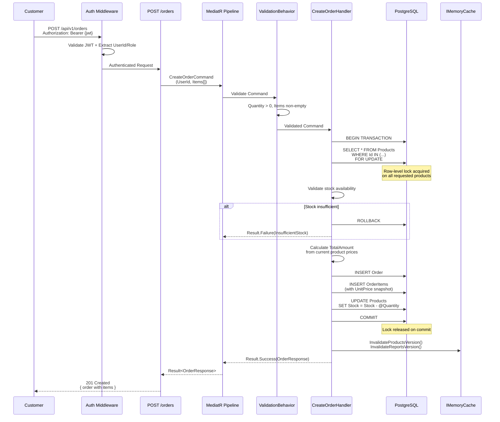
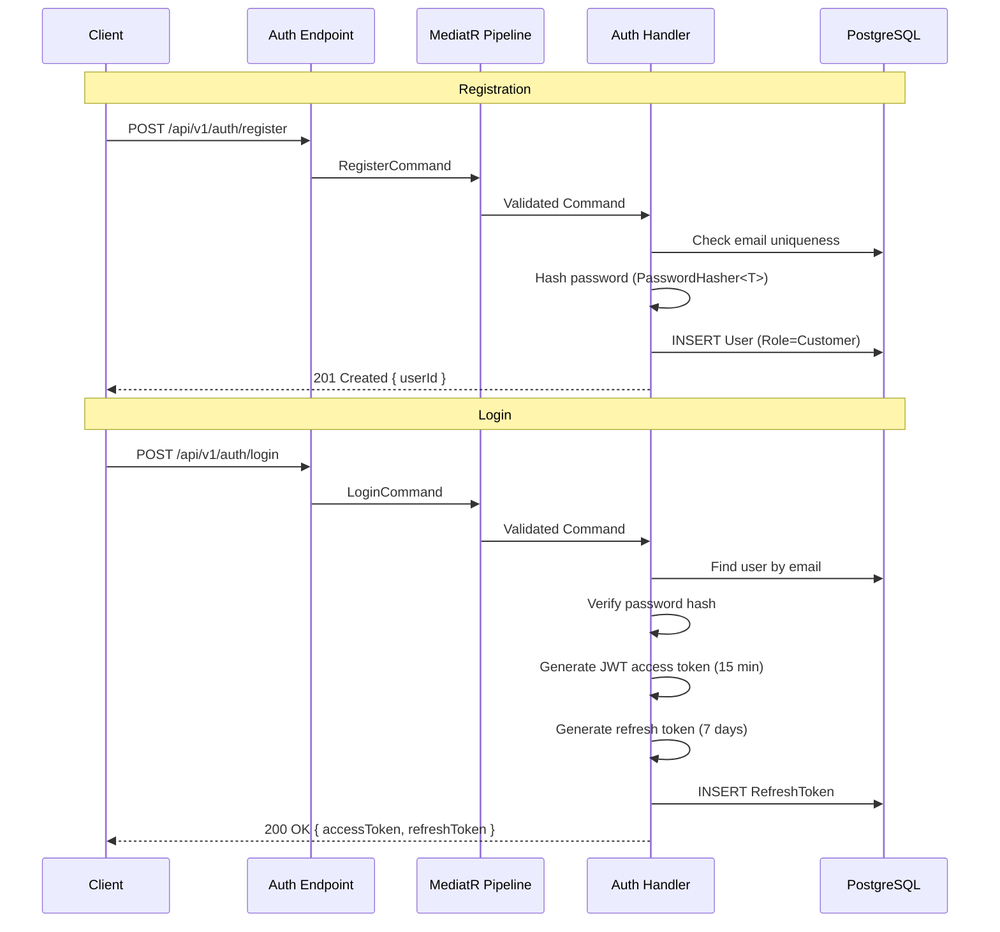
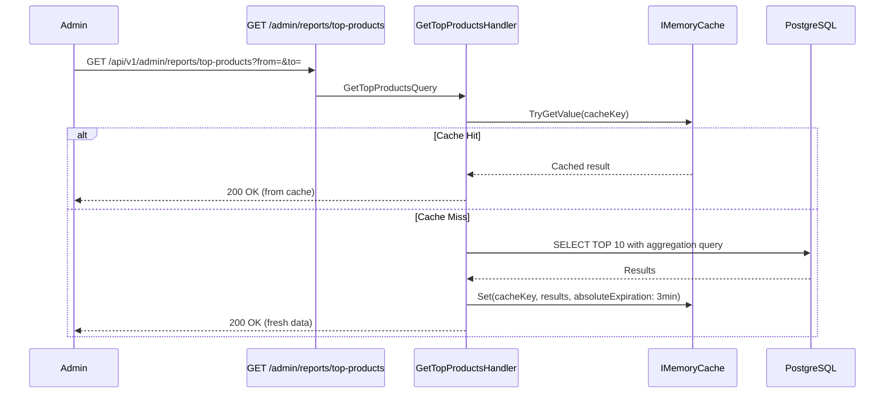
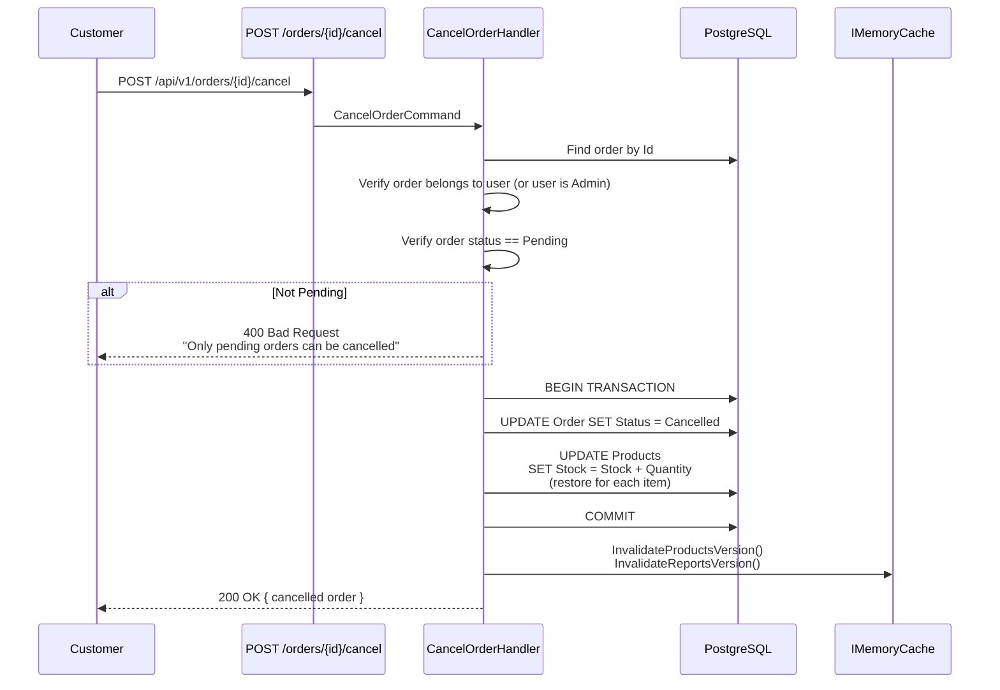

# 6. Runtime View

## 6.1 Scenario: Create Order (Most Critical Path)

The order creation flow is the most complex scenario — it involves authentication, validation, pessimistic locking, atomic stock deduction, price snapshotting, and cache invalidation within a single transaction.



### Key Guarantees

| Guarantee | Mechanism |
|-----------|-----------|
| No overselling | `SELECT ... FOR UPDATE` locks product rows until transaction commits |
| Price accuracy | `UnitPrice` is snapshotted from `Product.Price` at order creation time |
| Atomicity | Stock deduction + order creation in a single database transaction |
| Consistency | If any step fails, the entire transaction rolls back |
| Cache coherence | Product and report cache versions are invalidated after successful order |

## 6.2 Scenario: Authentication (Register → Login)



## 6.3 Scenario: Cached Report Query



### Cache Invalidation Flow

When an order is created or a product is modified, the handler calls:

```
CacheKeys.InvalidateProducts()   → Resets products version
CacheKeys.InvalidateReports()    → Resets reports version
```

Old cache entries become orphaned (version key changed) and expire by TTL (3–10 minutes).

## 6.4 Scenario: Cancel Order (Stock Restore)


