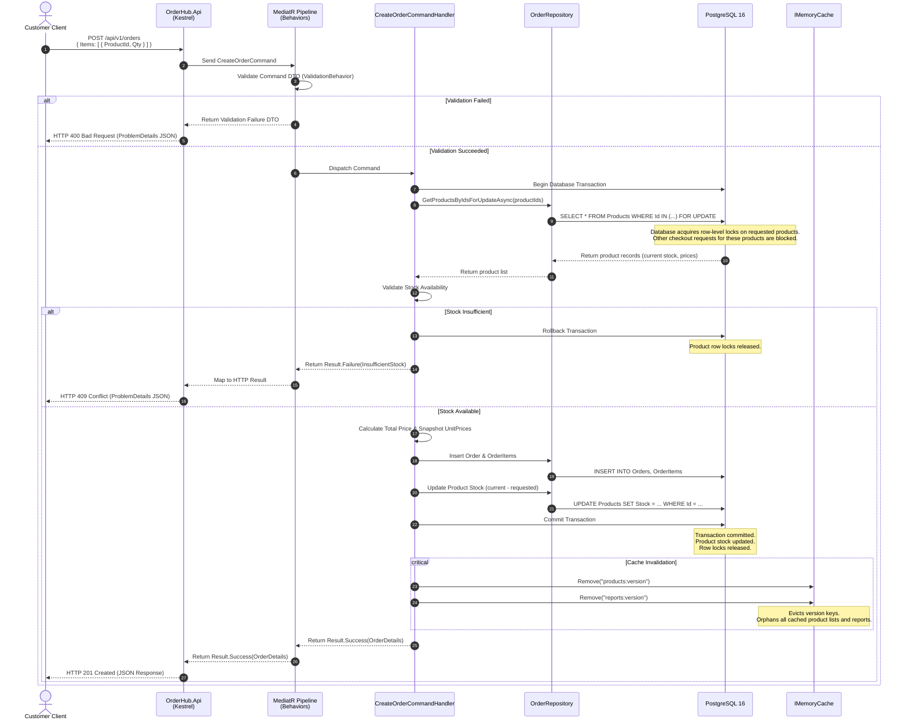
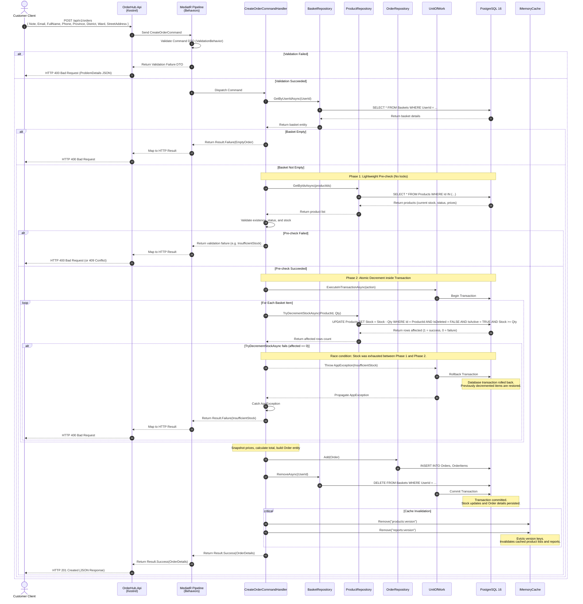
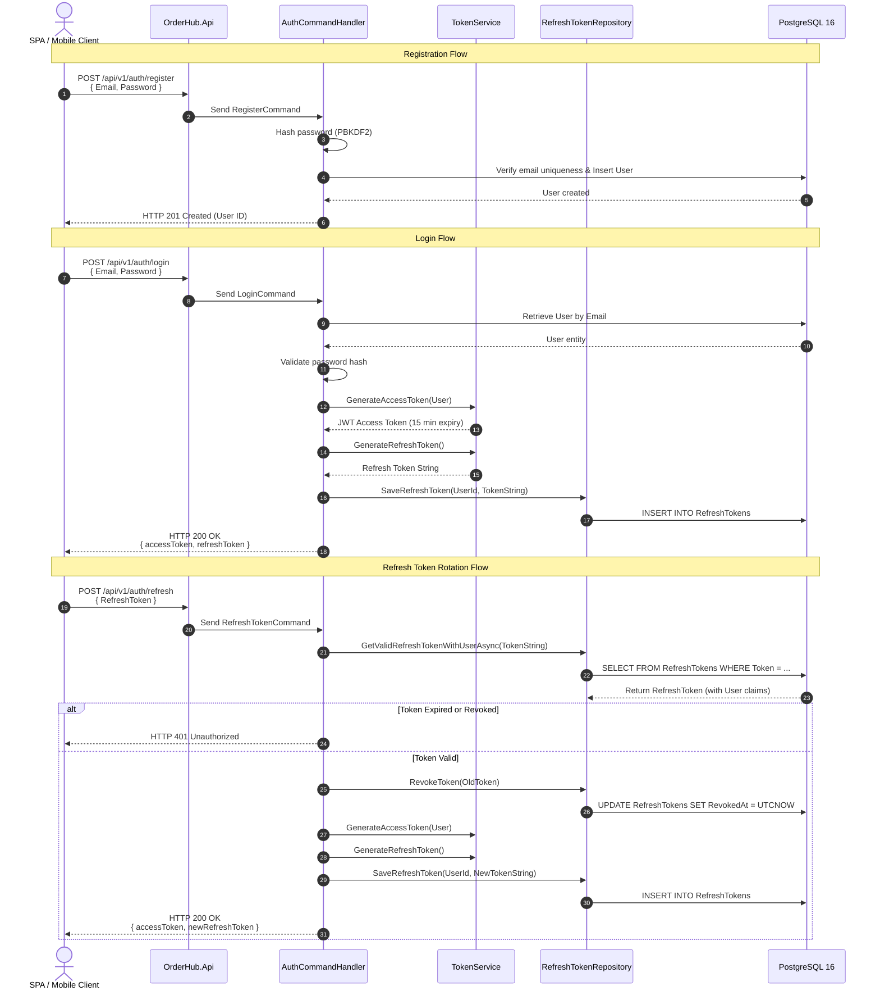
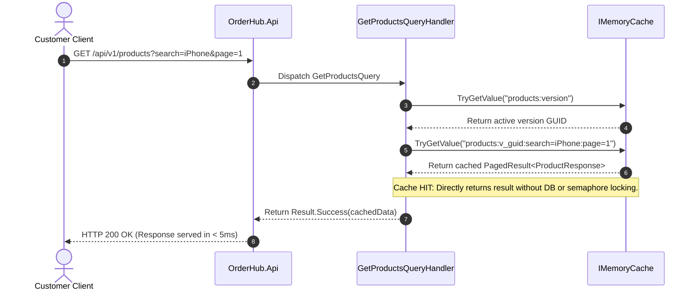
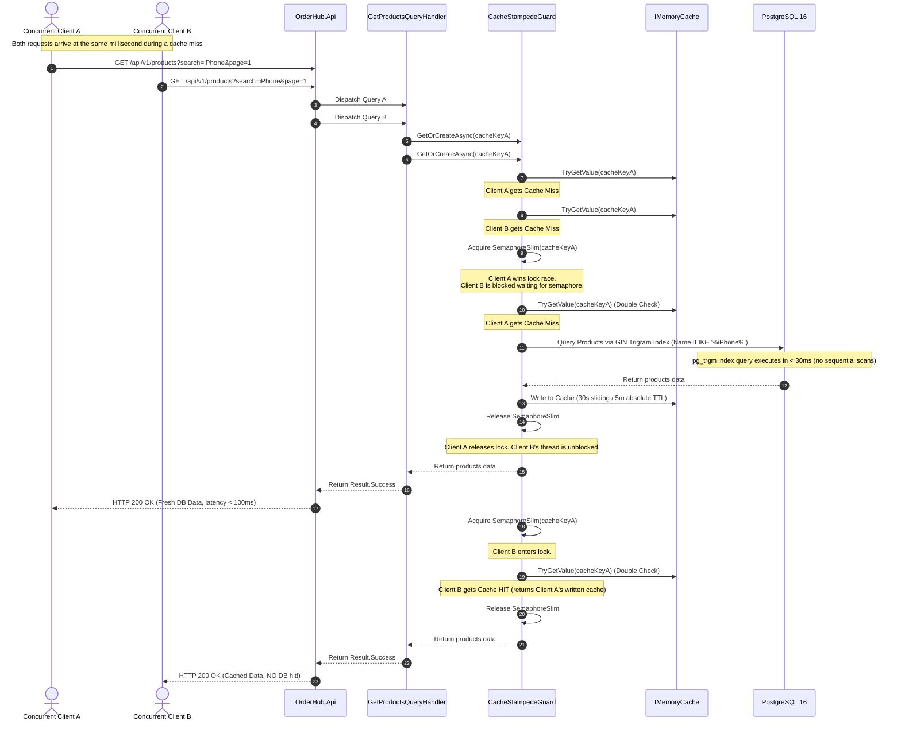
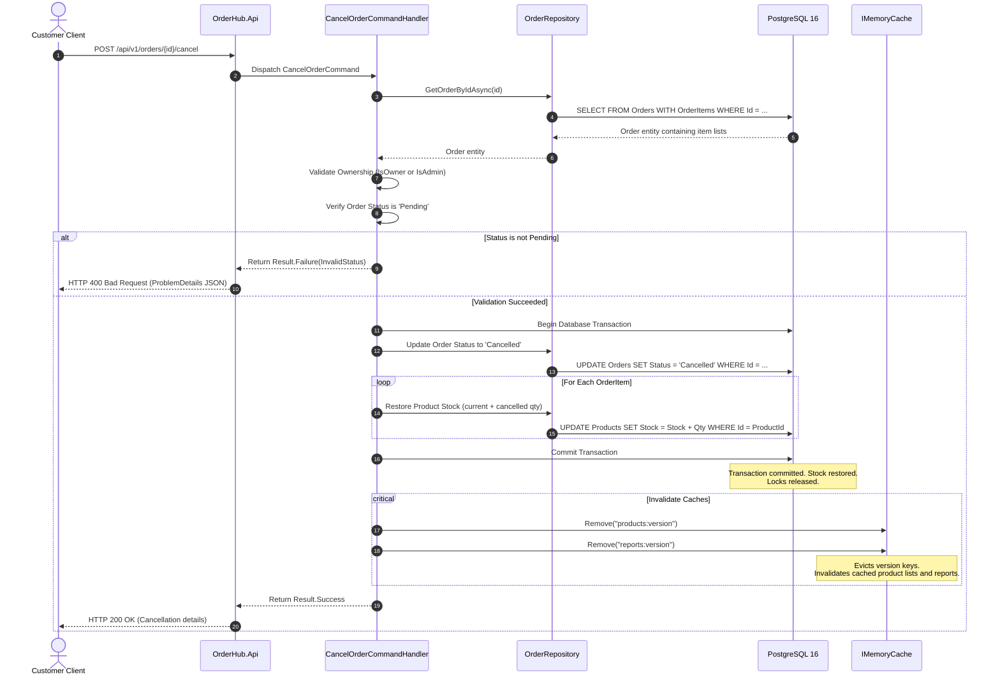

# 6. Runtime View

This section describes key runtime scenarios, showing how components interact to execute core use cases.

## 6.1 Scenario 1: Create Order with Concurrency Control (Pessimistic Locking)

The order creation process must guarantee that stock counts are accurate. It prevents overselling (double-selling) under concurrent loads by acquiring row-level database locks.

```mermaid
sequenceDiagram
    autonumber
    actor Customer as Customer Client
    participant API as OrderHub.Api<br/>(Kestrel)
    participant Pipe as MediatR Pipeline<br/>(Behaviors)
    participant Handler as CreateOrderCommandHandler
    participant Repo as OrderRepository
    participant DB as PostgreSQL 16
    participant Cache as IMemoryCache

    Customer->>API: POST /api/v1/orders<br/>{ Items: [ { ProductId, Qty } ] }
    API->>Pipe: Send CreateOrderCommand
    Pipe->>Pipe: Validate Command DTO (ValidationBehavior)
    
    alt Validation Failed
        Pipe-->>API: Return Validation Failure DTO
        API-->>Customer: HTTP 400 Bad Request (ProblemDetails JSON)
    else Validation Succeeded
        Pipe->>Handler: Dispatch Command
        Handler->>DB: Begin Database Transaction
        Handler->>Repo: GetProductsByIdsForUpdateAsync(productIds)
        Repo->>DB: SELECT * FROM Products WHERE Id IN (...) FOR UPDATE
        Note over DB: Database acquires row-level locks on requested products.<br/>Other checkout requests for these products are blocked.
        DB-->>Repo: Return product records (current stock, prices)
        Repo-->>Handler: Return product list
        
        Handler->>Handler: Validate Stock Availability
        alt Stock Insufficient
            Handler->>DB: Rollback Transaction
            Note over DB: Product row locks released.
            Handler-->>Pipe: Return Result.Failure(InsufficientStock)
            Pipe-->>API: Map to HTTP Result
            API-->>Customer: HTTP 409 Conflict (ProblemDetails JSON)
        else Stock Available
            Handler->>Handler: Calculate Total Price & Snapshot UnitPrices
            Handler->>Repo: Insert Order & OrderItems
            Repo->>DB: INSERT INTO Orders, OrderItems
            Handler->>Repo: Update Product Stock (current - requested)
            Repo->>DB: UPDATE Products SET Stock = ... WHERE Id = ...
            Handler->>DB: Commit Transaction
            Note over DB: Transaction committed.<br/>Product stock updated.<br/>Row locks released.
            
            critical Cache Invalidation
                Handler->>Cache: Remove("products:version")
                Handler->>Cache: Remove("reports:version")
                Note over Cache: Evicts version keys.<br/>Orphans all cached product lists and reports.
            end
            
            Handler-->>Pipe: Return Result.Success(OrderDetails)
            Pipe-->>API: Return Result.Success(OrderDetails)
            API-->>Customer: HTTP 201 Created (JSON Response)
        end
    end
```

### Key Execution Highlights
*   **Row-Level Lock Acquisition (Step 9):** The `FOR UPDATE` clause instructs PostgreSQL to acquire exclusive row locks on the matched rows in the `Products` table. Any concurrent transaction attempting to read or write those same rows for update will block.
*   **Price Snapshotting (Step 15):** The current price is copied from the `Product` entity directly into the `OrderItem` table as `UnitPrice`. This prevents subsequent catalog price changes from modifying the calculated price of historical orders.
*   **Cache Invalidation (Step 19-21):** Cache versions are invalidated by removing the version key from `IMemoryCache`. This avoids iterating through and removing individual cache keys, which is an $O(N)$ operation.

---

## 6.2 Scenario 2: Create Order with Concurrency Control (Atomic Decrement - V2)

This workflow optimizes order creation under high concurrency. Instead of acquiring database row locks during the read phase (which blocks other concurrent transactions), it uses a lightweight read for initial validation, followed by a single atomic `UPDATE` statement that decreases the stock count directly in the database. 

If any item's stock cannot be decremented (due to insufficient stock, product deletion, or inactivity), the atomic update fails (returning 0 rows affected), an `AppException` is thrown inside the transaction callback to trigger a transaction rollback, and the exception is caught to return a clean failure result.

```mermaid
sequenceDiagram
    autonumber
    actor Customer as Customer Client
    participant API as OrderHub.Api<br/>(Kestrel)
    participant Pipe as MediatR Pipeline<br/>(Behaviors)
    participant Handler as CreateOrderCommandHandler
    participant BasketRepo as BasketRepository
    participant ProductRepo as ProductRepository
    participant OrderRepo as OrderRepository
    participant UOW as UnitOfWork
    participant DB as PostgreSQL 16
    participant Cache as IMemoryCache

    Customer->>API: POST /api/v1/orders<br/>{ Note, Email, FullName, Phone, Province, District, Ward, StreetAddress }
    API->>Pipe: Send CreateOrderCommand
    Pipe->>Pipe: Validate Command DTO (ValidationBehavior)
    
    alt Validation Failed
        Pipe-->>API: Return Validation Failure DTO
        API-->>Customer: HTTP 400 Bad Request (ProblemDetails JSON)
    else Validation Succeeded
        Pipe->>Handler: Dispatch Command
        Handler->>BasketRepo: GetByUserIdAsync(UserId)
        BasketRepo->>DB: SELECT * FROM Baskets WHERE UserId = ...
        DB-->>BasketRepo: Return basket details
        BasketRepo-->>Handler: Return basket entity
        
        alt Basket Empty
            Handler-->>Pipe: Return Result.Failure(EmptyOrder)
            Pipe-->>API: Map to HTTP Result
            API-->>Customer: HTTP 400 Bad Request
        else Basket Not Empty
            Note over Handler,DB: Phase 1: Lightweight Pre-check (No locks)
            Handler->>ProductRepo: GetByIdsAsync(productIds)
            ProductRepo->>DB: SELECT * FROM Products WHERE Id IN (...)
            DB-->>ProductRepo: Return products (current stock, status, prices)
            ProductRepo-->>Handler: Return product list
            
            Handler->>Handler: Validate existence, status, and stock
            alt Pre-check Failed
                Handler-->>Pipe: Return validation failure (e.g. InsufficientStock)
                Pipe-->>API: Map to HTTP Result
                API-->>Customer: HTTP 400 Bad Request (or 409 Conflict)
            else Pre-check Succeeded
                Note over Handler,DB: Phase 2: Atomic Decrement inside Transaction
                Handler->>UOW: ExecuteInTransactionAsync(action)
                UOW->>DB: Begin Transaction
                
                loop For Each Basket Item
                    Handler->>ProductRepo: TryDecrementStockAsync(ProductId, Qty)
                    ProductRepo->>DB: UPDATE Products SET Stock = Stock - Qty WHERE Id = ProductId AND IsDeleted = FALSE AND IsActive = TRUE AND Stock >= Qty
                    DB-->>ProductRepo: Return rows affected (1 = success, 0 = failure)
                    ProductRepo-->>Handler: Return affected rows count
                    
                    alt TryDecrementStockAsync fails (affected == 0)
                        Note over Handler,DB: Race condition: Stock was exhausted between Phase 1 and Phase 2.
                        Handler-->>UOW: Throw AppException(InsufficientStock)
                        UOW->>DB: Rollback Transaction
                        Note over DB: Database transaction rolled back.<br/>Previously decremented items are restored.
                        UOW-->>Handler: Propagate AppException
                        Handler->>Handler: Catch AppException
                        Handler-->>Pipe: Return Result.Failure(InsufficientStock)
                        Pipe-->>API: Map to HTTP Result
                        API-->>Customer: HTTP 400 Bad Request
                    end
                end
                
                Note over Handler: Snapshot prices, calculate total, build Order entity
                Handler->>OrderRepo: Add(Order)
                OrderRepo->>DB: INSERT INTO Orders, OrderItems
                
                Handler->>BasketRepo: RemoveAsync(UserId)
                BasketRepo->>DB: DELETE FROM Baskets WHERE UserId = ...
                
                UOW->>DB: Commit Transaction
                Note over DB: Transaction committed.<br/>Stock updates and Order details persisted.
                
                critical Cache Invalidation
                    Handler->>Cache: Remove("products:version")
                    Handler->>Cache: Remove("reports:version")
                    Note over Cache: Evicts version keys.<br/>Invalidates cached product lists and reports.
                end
                
                Handler-->>Pipe: Return Result.Success(OrderDetails)
                Pipe-->>API: Return Result.Success(OrderDetails)
                API-->>Customer: HTTP 201 Created (JSON Response)
            end
        end
    end
```

### Key Execution Highlights
* **Non-Blocking Read (Phase 1):** The handler fetches the products with a standard `SELECT` query, avoiding `FOR UPDATE` locking. This eliminates database contention for hot items during catalog browsing or high-volume checkouts.
* **Database Guarded Atomic Decrement (Phase 2):** Instead of checking stock in memory and performing an un-guarded update, the SQL `UPDATE` statement contains the check logic: `AND "Stock" >= {quantity}`. Since updates are run sequentially/atomically per row in PostgreSQL, this ensures stock never goes below zero.
* **All-or-Nothing Transactional Consistency:** If checking out multiple products and any single product's atomic decrement fails, the transaction is rolled back, guaranteeing that no partial stock decrements occur.
* **Cache Invalidation:** Once the transaction commits, product stock caching is invalidated to ensure customers see updated stock values on the catalog page.

---

## 6.3 Scenario 3: Authentication & Token Refresh (JWT Rotation)

This scenario illustrates the workflow for registering a user, logging in to obtain tokens, and using the refresh token to rotate expired access tokens.

```mermaid
sequenceDiagram
    autonumber
    actor Client as SPA / Mobile Client
    participant API as OrderHub.Api
    participant Handler as AuthCommandHandler
    participant TokenSvc as TokenService
    participant Repo as RefreshTokenRepository
    participant DB as PostgreSQL 16

    Note over Client,DB: Registration Flow
    Client->>API: POST /api/v1/auth/register<br/>{ Email, Password }
    API->>Handler: Send RegisterCommand
    Handler->>Handler: Hash password (PBKDF2)
    Handler->>DB: Verify email uniqueness & Insert User
    DB-->>Handler: User created
    Handler-->>Client: HTTP 201 Created (User ID)

    Note over Client,DB: Login Flow
    Client->>API: POST /api/v1/auth/login<br/>{ Email, Password }
    API->>Handler: Send LoginCommand
    Handler->>DB: Retrieve User by Email
    DB-->>Handler: User entity
    Handler->>Handler: Validate password hash
    Handler->>TokenSvc: GenerateAccessToken(User)
    TokenSvc-->>Handler: JWT Access Token (15 min expiry)
    Handler->>TokenSvc: GenerateRefreshToken()
    TokenSvc-->>Handler: Refresh Token String
    Handler->>Repo: SaveRefreshToken(UserId, TokenString)
    Repo->>DB: INSERT INTO RefreshTokens
    Handler-->>Client: HTTP 200 OK<br/>{ accessToken, refreshToken }

    Note over Client,DB: Refresh Token Rotation Flow
    Client->>API: POST /api/v1/auth/refresh<br/>{ RefreshToken }
    API->>Handler: Send RefreshTokenCommand
    Handler->>Repo: GetValidRefreshTokenWithUserAsync(TokenString)
    Repo->>DB: SELECT FROM RefreshTokens WHERE Token = ...
    DB-->>Repo: Return RefreshToken (with User claims)
    
    alt Token Expired or Revoked
        Handler-->>Client: HTTP 401 Unauthorized
    else Token Valid
        Handler->>Repo: RevokeToken(OldToken)
        Repo->>DB: UPDATE RefreshTokens SET RevokedAt = UTCNOW
        Handler->>TokenSvc: GenerateAccessToken(User)
        Handler->>TokenSvc: GenerateRefreshToken()
        Handler->>Repo: SaveRefreshToken(UserId, NewTokenString)
        Repo->>DB: INSERT INTO RefreshTokens
        Handler-->>Client: HTTP 200 OK<br/>{ accessToken, newRefreshToken }
    end
```

---

## 6.4 Scenario 4: High-Performance Catalog Search & Caching (GET /api/v1/products)

To guarantee sub-200ms (typically sub-50ms) latency for the catalog search endpoint under high-traffic load, OrderHub implements a dual-path caching and search-indexing strategy.

### 6.4.1 Scenario 4a: High-Performance Cache HIT (Fast Path - Latency < 5ms)

When the queried catalog parameters are already cached, the handler retrieves the pre-assembled results directly from `IMemoryCache` in memory. This path bypasses the database and locks entirely, completing in under 5ms.

```mermaid
sequenceDiagram
    autonumber
    actor Client as Customer Client
    participant API as OrderHub.Api
    participant Handler as GetProductsQueryHandler
    participant Cache as IMemoryCache

    Client->>API: GET /api/v1/products?search=iPhone&page=1
    API->>Handler: Dispatch GetProductsQuery
    
    %% Step 1: Resolve current cache version
    Handler->>Cache: TryGetValue("products:version")
    Cache-->>Handler: Return active version GUID
    
    %% Step 2: Look up specific query cache key
    Handler->>Cache: TryGetValue("products:v_guid:search=iPhone:page=1")
    Cache-->>Handler: Return cached PagedResult<ProductResponse>
    
    Note over Handler,Cache: Cache HIT: Directly returns result without DB or semaphore locking.
    
    Handler-->>API: Return Result.Success(cachedData)
    API-->>Client: HTTP 200 OK (Response served in < 5ms)
```

---

### 6.4.2 Scenario 4b: Cache MISS with Thundering Herd Prevention and GIN Search (Latency < 100ms)

When concurrent requests miss the cache (e.g. after database migrations or invalidation), the `CacheStampedeGuard` locks concurrent threads on a key-specific semaphore to prevent overloading the database. The single database thread resolves the text query in milliseconds using the **GIN Trigram Index** before populating the cache.

```mermaid
sequenceDiagram
    autonumber
    actor ClientA as Concurrent Client A
    actor ClientB as Concurrent Client B
    participant API as OrderHub.Api
    participant Handler as GetProductsQueryHandler
    participant Guard as CacheStampedeGuard
    participant Cache as IMemoryCache
    participant DB as PostgreSQL 16

    Note over ClientA,ClientB: Both requests arrive at the same millisecond during a cache miss
    ClientA->>API: GET /api/v1/products?search=iPhone&page=1
    ClientB->>API: GET /api/v1/products?search=iPhone&page=1
    API->>Handler: Dispatch Query A
    API->>Handler: Dispatch Query B
    
    Handler->>Guard: GetOrCreateAsync(cacheKeyA)
    Handler->>Guard: GetOrCreateAsync(cacheKeyA)

    %% Step 1: Check cache without locks
    Guard->>Cache: TryGetValue(cacheKeyA)
    Note over Guard: Client A gets Cache Miss
    Guard->>Cache: TryGetValue(cacheKeyA)
    Note over Guard: Client B gets Cache Miss

    %% Step 2: Lock acquisition
    Guard->>Guard: Acquire SemaphoreSlim(cacheKeyA)
    Note over Guard: Client A wins lock race.<br/>Client B is blocked waiting for semaphore.
    
    %% Step 3: Winner double check cache
    Guard->>Cache: TryGetValue(cacheKeyA) (Double Check)
    Note over Guard: Client A gets Cache Miss
    
    %% Step 4: Query database via GIN Trigram search index
    Guard->>DB: Query Products via GIN Trigram Index (Name ILIKE '%iPhone%')
    Note over DB: pg_trgm index query executes in < 30ms (no sequential scans)
    DB-->>Guard: Return products data
    Guard->>Cache: Write to Cache (30s sliding / 5m absolute TTL)
    Guard->>Guard: Release SemaphoreSlim
    Note over Guard: Client A releases lock. Client B's thread is unblocked.
    Guard-->>Handler: Return products data
    Handler-->>API: Return Result.Success
    API-->>ClientA: HTTP 200 OK (Fresh DB Data, latency < 100ms)

    %% Step 5: Loser processing after unblock
    Guard->>Guard: Acquire SemaphoreSlim(cacheKeyA)
    Note over Guard: Client B enters lock.
    Guard->>Cache: TryGetValue(cacheKeyA) (Double Check)
    Note over Guard: Client B gets Cache HIT (returns Client A's written cache)
    Guard->>Guard: Release SemaphoreSlim
    Guard-->>Handler: Return products data
    Handler-->>API: Return Result.Success
    API-->>ClientB: HTTP 200 OK (Cached Data, NO DB hit!)
```

---

## 6.5 Scenario 5: Cancel Order with Stock Restoration

When a pending order is cancelled, the application updates the order status and restores the reserved product stock. Both operations run within a single transaction to ensure consistency.

```mermaid
sequenceDiagram
    autonumber
    actor Customer as Customer Client
    participant API as OrderHub.Api
    participant Handler as CancelOrderCommandHandler
    participant Repo as OrderRepository
    participant DB as PostgreSQL 16
    participant Cache as IMemoryCache

    Customer->>API: POST /api/v1/orders/{id}/cancel
    API->>Handler: Dispatch CancelOrderCommand
    Handler->>Repo: GetOrderByIdAsync(id)
    Repo->>DB: SELECT FROM Orders WITH OrderItems WHERE Id = ...
    DB-->>Repo: Order entity containing item lists
    Repo-->>Handler: Order entity
    
    Handler->>Handler: Validate Ownership (IsOwner or IsAdmin)
    Handler->>Handler: Verify Order Status is 'Pending'
    
    alt Status is not Pending
        Handler-->>API: Return Result.Failure(InvalidStatus)
        API-->>Customer: HTTP 400 Bad Request (ProblemDetails JSON)
    else Validation Succeeded
        Handler->>DB: Begin Database Transaction
        Handler->>Repo: Update Order Status to 'Cancelled'
        Repo->>DB: UPDATE Orders SET Status = 'Cancelled' WHERE Id = ...
        
        loop For Each OrderItem
            Handler->>Repo: Restore Product Stock (current + cancelled qty)
            Repo->>DB: UPDATE Products SET Stock = Stock + Qty WHERE Id = ProductId
        end
        
        Handler->>DB: Commit Transaction
        Note over DB: Transaction committed. Stock restored.<br/>Locks released.
        
        critical Invalidate Caches
            Handler->>Cache: Remove("products:version")
            Handler->>Cache: Remove("reports:version")
            Note over Cache: Evicts version keys.<br/>Invalidates cached product lists and reports.
        end
        
        Handler-->>API: Return Result.Success
        API-->>Customer: HTTP 200 OK (Cancellation details)
    end
```
