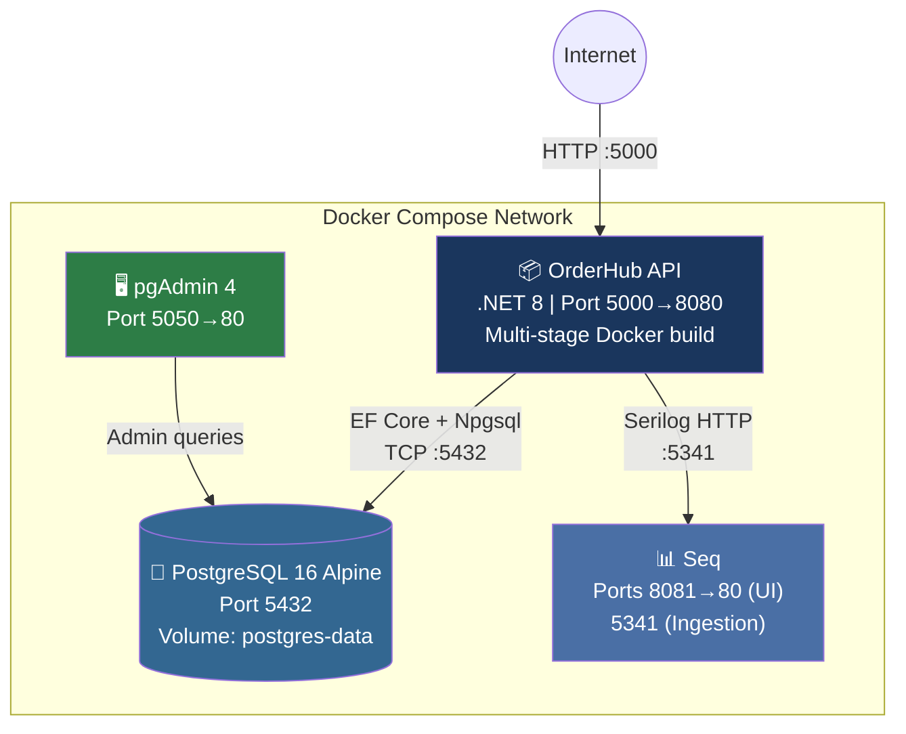

# 7. Deployment View

## 7.1 Deployment Topology

OrderHub is deployed as a set of Docker containers managed by docker-compose. All services run on a single host.

## 7.2 Service Details

| Service | Image | Ports | Health Check |
|---------|-------|-------|-------------|
| **orderhub-api** | Custom multi-stage build | `5000:8080` | `GET /health/ready` |
| **orderhub-db** | `postgres:16-alpine` | `5432:5432` | `pg_isready` |
| **orderhub-pgadmin** | `dpage/pgadmin4` | `5050:80` | HTTP check |
| **orderhub-seq** | `datalust/seq` | `8081:80`, `5341:5341` | HTTP check |

## 7.3 Dockerfile (Multi-Stage Build)

The API uses a multi-stage Docker build:

| Stage | Base Image | Purpose |
|-------|-----------|---------|
| **Build** | `mcr.microsoft.com/dotnet/sdk:8.0` | Restore, build, publish |
| **Runtime** | `mcr.microsoft.com/dotnet/aspnet:8.0` | Run the published app |

The final image contains only the compiled output — no SDK, no source code.

## 7.4 Environment Variables

| Variable | Required | Description |
|----------|----------|-------------|
| `ConnectionStrings__DefaultConnection` | Yes | PostgreSQL connection string |
| `Jwt__Key` | Yes | Minimum 32 characters |
| `Jwt__Issuer` | Yes | Token issuer |
| `Jwt__Audience` | Yes | Token audience |
| `Seq__ServerUrl` | No | Seq ingestion URL (Dev only) |
| `ASPNETCORE_ENVIRONMENT` | No | `Development` / `Production` |

:::warning
Never commit `.env` to source control. Use `.env.example` as a template.
:::

## 7.5 Database Migrations

Migrations are applied automatically on startup via a hosted service:

1. On application start, `DatabaseMigrationHostedService` runs
2. Applies any pending EF Core migrations
3. Seeds initial data if the database is empty
4. Application begins accepting requests only after migration completes

## 7.6 Volume Management

| Volume | Purpose | Persistence |
|--------|---------|-------------|
| `postgres-data` | PostgreSQL data files | Survives container restarts |
| Seq data | Structured logs | Ephemeral (Dev only) |

## 7.7 Production Deployment Considerations

| Concern | Current | Recommended |
|---------|---------|-------------|
| HTTPS | Configured via Kestrel | Use reverse proxy (nginx/Traefik) for TLS termination |
| Scaling | Single instance | Add load balancer + Redis cache for multi-instance |
| Secrets | Environment variables | Use Docker Secrets or cloud secret management |
| CI/CD | Manual | GitHub Actions pipeline (planned) |
| Monitoring | Seq (Dev) | OpenTelemetry + Jaeger (planned) |
