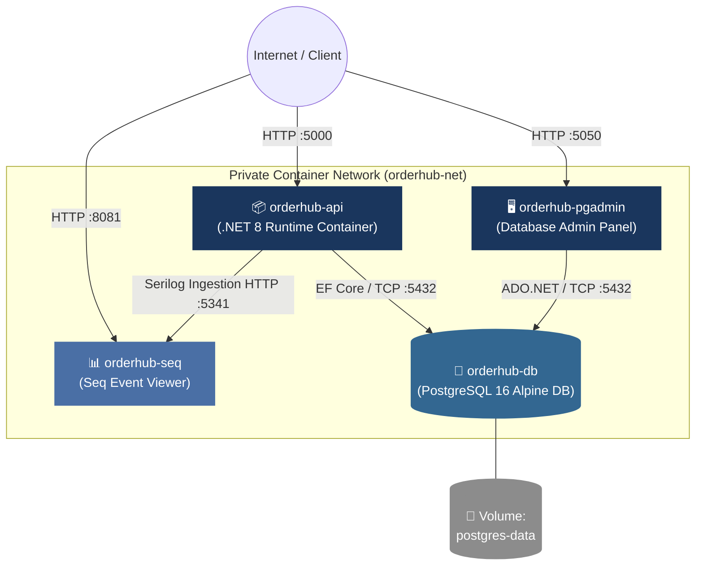
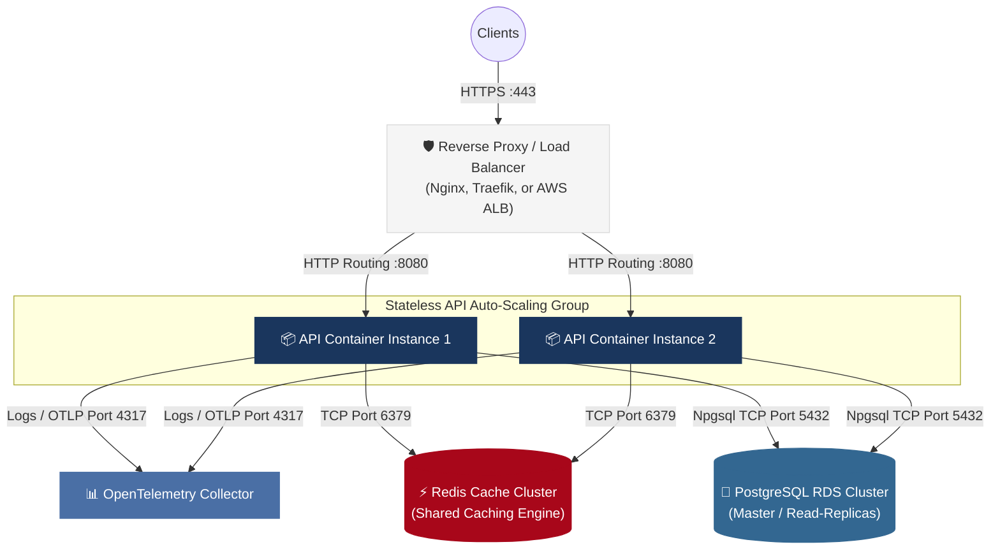

# 7. Deployment View

The Deployment View describes the physical environment in which OrderHub runs. It details the container topology, backing service configurations, volume maps, and production scaling strategies.

## 7.1 Development & Single-Host Deployment Topology

For local development and single-host staging environments, OrderHub uses **Docker Compose**. All containers run inside a private bridge network (`orderhub-net`) on a single virtual host.

```mermaid
graph TB
    Internet((Internet / Client)) -->|"HTTP :5000"| API["📦 orderhub-api<br/>(.NET 8 Runtime Container)"]
    Internet -->|"HTTP :5050"| PGA["🖥️ orderhub-pgadmin<br/>(Database Admin Panel)"]
    Internet -->|"HTTP :8081"| SEQ["📊 orderhub-seq<br/>(Seq Event Viewer)"]

    subgraph Net ["Private Container Network (orderhub-net)"]
        API
        PGA
        SEQ
        DB[("🐘 orderhub-db<br/>(PostgreSQL 16 Alpine DB)")]
    end

    %% Storage Volumes
    DB --- VolDB[("💾 Volume:<br/>postgres-data")]

    %% Internal Communication
    API -->|"EF Core / TCP :5432"| DB
    API -->|"Serilog Ingestion HTTP :5341"| SEQ
    PGA -->|"ADO.NET / TCP :5432"| DB

    classDef host fill:#f5f5f5,stroke:#d9d9d9,color:#333;
    classDef container fill:#1a365d,stroke:#1a365d,color:#fff;
    classDef database fill:#336791,stroke:#336791,color:#fff;
    classDef tool fill:#4a6fa5,stroke:#4a6fa5,color:#fff;
    classDef volume fill:#8c8c8c,stroke:#8c8c8c,color:#fff;

    class API,PGA container;
    class DB database;
    class SEQ tool;
    class VolDB volume;
```

---

## 7.2 Containerized Service Specifications

The `docker-compose.yml` file configures the following container resources:

| Service Name | Base Container Image | External Host Port | Internal Port | Environment & Volumes |
|---|---|---|---|---|
| **`orderhub-api`** | Custom multi-stage build (from `mcr.microsoft.com/dotnet/aspnet:8.0`) | `5000` | `8080` | Environment secrets read from the `.env` configuration file. Depends on `orderhub-db` readiness. |
| **`orderhub-db`** | `postgres:16-alpine` | `5432` (Optional) | `5432` | Environment sets DB username, password, and target catalog. Binds a persistent named volume: `postgres-data:/var/lib/postgresql/data`. |
| **`orderhub-pgadmin`** | `dpage/pgadmin4` | `5050` | `80` | Provides a web-based UI to manage PostgreSQL. Exposes connection setups to query the DB directly. |
| **`orderhub-seq`**| `datalust/seq` | `8081` (UI) `5341` (API) | `80` `5341` | Event analyzer that ingests Serilog JSON structures. Stores logs in an ephemeral layout for local execution. |

---

## 7.3 Autonomic Database Migrations & Data Seeding

OrderHub executes database schema updates programmatically on startup, ensuring database schemas match the application code without requiring manual steps during deployment.

### 7.3.1 Startup Migration Lifecycle
1.  On application start, the container runs the entry assembly (`OrderHub.Api`).
2.  `DatabaseMigrationHostedService` (implementing `IHostedService`) runs before the Kestrel web server begins accepting external HTTP requests.
3.  The hosted service requests an EF Core `DbContext` instance from a scoped dependency container.
4.  **Schema Sync:** It executes `context.Database.MigrateAsync()`. This command:
    *   Creates the metadata tracking table `__EFMigrationsHistory` if it does not exist.
    *   Applies any pending database schema migrations.
    *   **Enables PostgreSQL Extensions:** Runs the SQL command registering the `pg_trgm` extension required for trigram search index operations.
5.  **Seeding Loop:** Once migrations complete, the hosted service verifies if the `Products` table is empty. If empty, it triggers the `DataSeeder`:
    *   Generates default Admin and Customer accounts with hashed passwords (using PBKDF2).
    *   Generates and inserts **10,000 product records** to simulate a production-scale database.
    *   **Batching Strategy:** Products are inserted in batches of 2,000 records followed by `SaveChanges()` to prevent excessive RAM consumption and memory allocation overhead during startup.
6.  Upon successful completion, the service returns, allowing the Kestrel server to bind to port 8080 and accept external traffic.

---

## 7.4 Production Deployment Topology Recommendations

While the Docker Compose topology is suitable for development and staging, deploying OrderHub to a production environment (such as AWS, Azure, or Kubernetes) requires updating the infrastructure topology:

```mermaid
graph TB
    Client((Clients)) -->|"HTTPS :443"| Proxy["🛡️ Reverse Proxy / Load Balancer<br/>(Nginx, Traefik, or AWS ALB)"]
    
    subgraph API_Scale ["Stateless API Auto-Scaling Group"]
        API1["📦 API Container Instance 1"]
        API2["📦 API Container Instance 2"]
    end
    
    Proxy -->|"HTTP Routing :8080"| API1
    Proxy -->|"HTTP Routing :8080"| API2

    API1 & API2 -->|"Logs / OTLP Port 4317"| OTel["📊 OpenTelemetry Collector"]
    API1 & API2 -->|"TCP Port 6379"| Redis[("⚡ Redis Cache Cluster<br/>(Shared Caching Engine)")]
    API1 & API2 -->|"Npgsql TCP Port 5432"| PG[("🐘 PostgreSQL RDS Cluster<br/>(Master / Read-Replicas)")]

    classDef proxy fill:#f5f5f5,stroke:#d9d9d9,color:#333;
    classDef container fill:#1a365d,stroke:#1a365d,color:#fff;
    classDef database fill:#336791,stroke:#336791,color:#fff;
    classDef cache fill:#a8071a,stroke:#a8071a,color:#fff;
    classDef otel fill:#4a6fa5,stroke:#4a6fa5,color:#fff;

    class Proxy proxy;
    class API1,API2 container;
    class PG database;
    class Redis cache;
    class OTel otel;
```

### 1. SSL/TLS Termination and Gateway Management
*   **Current Setup:** Kestrel handles HTTP requests directly without TLS certificate termination.
*   **Production Recommendation:** Deploy a reverse proxy (such as Nginx, Traefik, Caddy, or a cloud application load balancer) in front of the API containers. The proxy handles SSL termination, manages certificates, applies rate limits at the network edge, and forwards cleaned traffic to the backend over HTTP.

### 2. Horizontal Scaling & High Availability
*   **Current Setup:** Single API container process (single point of failure).
*   **Production Recommendation:** Run multiple instances of the `orderhub-api` container behind a load balancer. If an instance fails, the load balancer routes traffic to the healthy nodes, and auto-scaling rules can spawn replacement instances.

### 3. Distributed Cache Integration (Cache Coherence)
*   **Current Setup:** `IMemoryCache` stores data in-process on a single container node.
*   **Production Recommendation:** If the API scales to multiple instances, local caching can lead to cache inconsistency (e.g., node 1 has stale product data, while node 2 has updated data). The in-process cache should be replaced with a distributed cache provider (such as Redis or Memcached) or .NET 9's `HybridCache` to maintain cache coherence across all API nodes.

### 4. Secret Storage Management
*   **Current Setup:** Plaintext secrets stored in a `.env` file on disk.
*   **Production Recommendation:** Inject secrets dynamically at runtime using cloud secret managers (such as AWS Secrets Manager, Azure Key Vault, HashiCorp Vault, or Docker secrets) to prevent credentials from being exposed in environment variables or configuration files.
