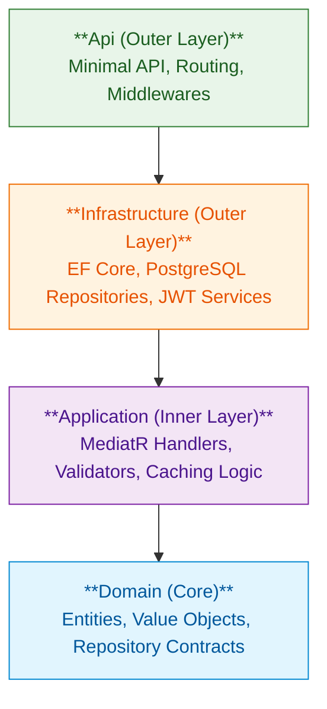

# ADR-001: Clean Architecture

## Status

✅ Accepted

## Context

OrderHub is a single-service monolith serving as a central order management engine. The system requires an architectural layout that:
*   Enforces a strict separation of concerns between core business logic and external infrastructure (databases, API delivery frameworks, logging systems).
*   Keeps the domain rules independent of frameworks, databases, and third-party tools.
*   Enables unit testing of core business use cases without requiring active database connections or HTTP request contexts.
*   Enforces boundaries compile-time to prevent architectural decay (e.g., preventing data access logic from leaking into the domain).
*   Accommodates CQRS (Command Query Responsibility Segregation) naturally.

## Decision

Adopt **Clean Architecture** structured across four distinct projects inside a single solution, enforcing the dependency inversion principle at the project reference level:

```
OrderHub.Api -> OrderHub.Infrastructure -> OrderHub.Application -> OrderHub.Domain
```

### Layer Responsibilities

| Project Namespace | Design Responsibility | External Dependencies |
|---|---|---|
| **`OrderHub.Domain`** | Enterprise-wide business rules. Contains domain entities (`Product`, `Order`, `User`), repository contract interfaces, and domain exceptions/errors. | **None.** Pure C# project with zero external packages. |
| **`OrderHub.Application`** | Application-specific business rules. Implements CQRS use cases (MediatR commands/queries and handlers), DTO mapping, FluentValidation rules, pipeline behaviors, and cache abstractions. | Depends only on `Domain`. |
| **`OrderHub.Infrastructure`** | Outward-facing infrastructure implementations. Houses database context (`DbContext`), entity configurations, repository implementations, security token services (JWT), password hashing, and logging configurations. | Depends on `Application` and `Domain`. |
| **`OrderHub.Api`** | Delivery mechanism boundary. Hosts Kestrel, minimal API route endpoints, global middlewares (exception handler, correlation ID), and input endpoint filters. | References `Infrastructure` (and transitively `Application` & `Domain`). |

### The Dependency Rule
Dependencies must point **inward only**. Projects in outer circles can reference inner projects, but inner projects cannot reference outer projects. Abstractions (interfaces) are defined in the inner layers, and their concrete implementations are provided in the outer layers (e.g., `OrderHub.Domain` defines `IProductRepository`, while `OrderHub.Infrastructure` implements it).



## Rationale

Four structural styles were evaluated:

| Attribute | Clean Architecture | Vertical Slice Architecture | Traditional N-Tier | DDD + Clean Architecture |
|---|---|---|---|---|
| **Domain Isolation** | ✅ Core rules isolated | ⚠️ Slices self-contained but mix logic | ❌ UI/BLL depend on DB layers | ✅ High domain isolation |
| **Abstraction Control** | ✅ High | ❌ Low (avoids abstractions) | ⚠️ Moderate | ✅ High |
| **Compile-time Boundaries** | ✅ Enforced by project references | ❌ Enforces by convention only | ❌ Highly prone to dependency cycles | ✅ Enforced by projects |
| **Boilerplate Overhead** | Moderate | Low | Low | High |

Clean Architecture was chosen because:
1.  **Enforces Strict Domain Isolation:** Inner layers remain pure and testable. Changes to database engines or API frameworks have zero impact on core domain models.
2.  **Compile-time Protection:** Enforcing boundaries at the project level prevents developers from accidentally referencing EF Core or HTTP namespaces in Domain or Application layers.
3.  **Encourages Testability:** Facilitates writing unit tests for use cases by allowing repositories and infrastructure services to be easily mocked.
4.  **Avoids DDD Over-engineering:** The project benefits from Clean Architecture's structural isolation without the overhead of DDD tactical patterns (such as aggregates, value objects, and domain event dispatchers) which are unnecessary for the current domain complexity.

## Consequences

**Positive:**
*   Core domain rules are highly decoupled from infrastructure and database frameworks.
*   Application use cases are easily unit-tested with mocked repositories.
*   Thin endpoints focus strictly on HTTP concerns, delegating execution to the Application layer.
*   CQRS command/query patterns map naturally to the Application layer structure.

**Negative:**
*   Increases directory and file counts (each use case requires a Command/Query, Handler, DTO, and Validator).
*   Introduces mapping abstraction overhead (DTOs must be mapped to domain entities at the boundary).
