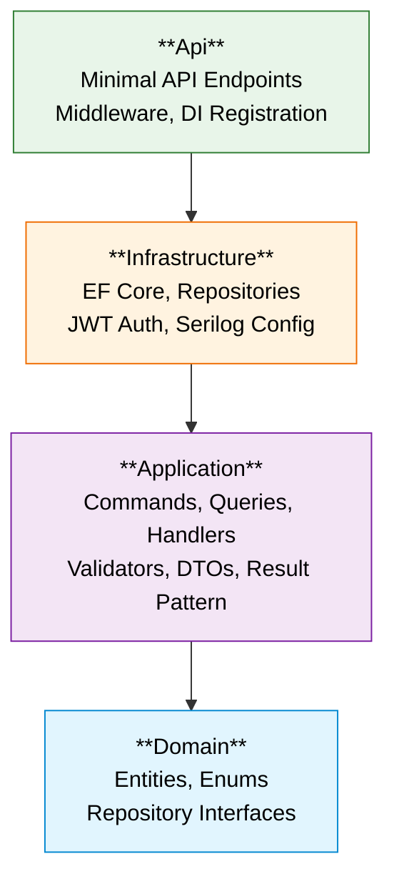

# ADR-011: Clean Architecture

## Status

✅ Accepted

## Context

OrderHub is a single-service monolith serving as a central order management API for an e-commerce platform. The system needs an architectural pattern that:

- Enforces **separation of concerns** between business logic and infrastructure
- Keeps the **domain independent** of frameworks, databases, and external services
- Enables **unit testing** of business logic without database or HTTP dependencies
- Provides **clear boundaries** between layers with explicit dependency direction
- Supports **CQRS** (Command Query Responsibility Segregation) for read/write separation
- Remains practical for a single-service monolith without over-engineering

## Decision

Adopt **Clean Architecture** with 4 projects in strict layered order, using dependency inversion to ensure inner layers have zero knowledge of outer layers:

```
Api → Infrastructure → Application → Domain
```

### Project Responsibilities

| Project | Responsibility | Dependencies |
|---------|---------------|-------------|
| **OrderHub.Domain** | Entities, enums, repository interfaces, value objects, `Result<T>`, error definitions | Zero external dependencies |
| **OrderHub.Application** | MediatR commands/queries/handlers, FluentValidation validators, DTOs, pipeline behaviors, caching | Domain only |
| **OrderHub.Infrastructure** | EF Core DbContext, repository implementations, JWT auth, Serilog configuration, seed data | Application + Domain |
| **OrderHub.Api** | Minimal API endpoints, middleware, DI registration, Program.cs | Infrastructure (transitively: Application, Domain) |

### Dependency Rule

Dependencies point **inward only**. The Domain layer has zero external dependencies — it defines repository interfaces that the Infrastructure layer implements. This is the core of the dependency inversion principle applied at the project level.



## Rationale

Four architectural patterns were evaluated:

| Criteria | Clean Architecture | Vertical Slice Architecture | N-Tier (Layered) | DDD + Clean Architecture |
|----------|-------------------|----------------------------|-------------------|--------------------------|
| **Dependency inversion** | ✅ Inner layers have zero infra knowledge | ⚠️ Each slice is self-contained | ❌ Layers often depend on infra | ✅ Inner layers isolated |
| **Testability** | ✅ Application layer unit-testable without DB | ⚠️ Slices require integration setup | ❌ Business logic often coupled to data access | ✅ Domain fully testable |
| **CQRS fit** | ✅ MediatR commands/queries map to Application layer | ✅ Native (each slice is a use case) | ⚠️ Service layer pattern | ✅ Application services + domain |
| **Complexity for monolith** | ✅ Structured without over-engineering | ⚠️ Potential code duplication across slices | ✅ Simple | ❌ Significant overhead (aggregates, domain events, bounded contexts) |
| **Clear boundaries** | ✅ 4-project layout enforces separation | ⚠️ Boundaries are conventions, not enforced | ❌ Often degenerates into anemic layers | ✅ Explicit bounded contexts |
| **Learning curve** | Moderate | Low to moderate | Low | High |

Clean Architecture was chosen because:

1. **Dependency inversion keeps Domain and Application testable** — handlers and validators can be unit-tested without database, HTTP, or any infrastructure concern
2. **The 4-project layout enforces boundaries at compile time** — a developer cannot accidentally reference EF Core from the Domain project because the project reference doesn't exist
3. **CQRS via MediatR maps naturally** onto the Application layer — Commands and Queries are first-class citizens in the `Features/` directory
4. **Sufficient for a single-service monolith** — provides all the benefits of structured architecture without the overhead of DDD tactical patterns (aggregates, domain events, bounded contexts)
5. **Widely understood pattern** — most .NET developers are familiar with Clean Architecture, reducing onboarding time

Vertical Slice Architecture was a strong contender but was rejected because the project benefits more from shared abstractions (common DTOs, validators, caching logic) across features, which Clean Architecture's layered approach provides naturally. N-Tier was rejected because it tends to degenerate into anemic layers where business logic leaks into the data access layer. DDD was rejected as over-engineered for the current domain complexity.

## Consequences

**Positive:**
- Clear dependency flow enforced at compile time (Api → Infrastructure → Application → Domain)
- Domain has zero external dependencies — pure business vocabulary
- Application layer handlers are easily unit-testable with mocked repositories
- Thin API endpoints — only HTTP concerns, no business logic
- CQRS via MediatR keeps business logic organized and separated
- Specific repository pattern in Domain isolates persistence concerns
- Result pattern keeps error handling explicit and testable
- Shared cross-cutting concerns (validation, logging behaviors) in Application layer

**Negative:**
- More files and indirection than a simple N-Tier approach (each feature has command/query/handler/validator/DTO)
- More boilerplate for simple CRUD operations
- Requires discipline to keep business logic in handlers, not in endpoints or repositories
- Potential over-abstraction for very simple operations (mitigated by pragmatic handler implementations)
