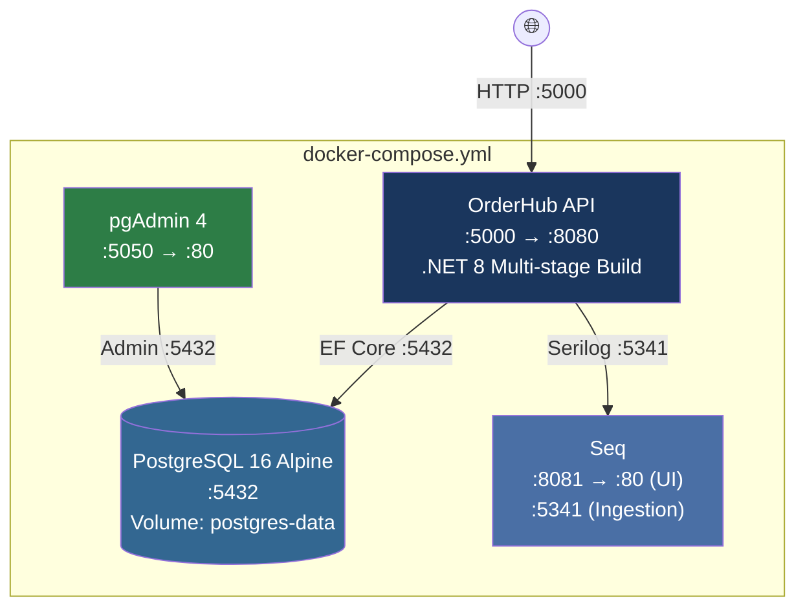

# Deployment Guide

## Docker Compose Architecture

OrderHub uses Docker Compose to orchestrate 4 services:



## Quick Deploy

```bash
# Clone and configure
git clone <repo-url>
cd OrderHub
cp .env.example .env
# Edit .env with your secrets

# Start all services
docker-compose up --build -d

# Verify
curl http://localhost:5000/health/ready
```

## Environment Configuration

### Required Variables

| Variable | Description | Example |
|----------|-------------|---------|
| `POSTGRES_DB` | Database name | `orderhub` |
| `POSTGRES_USER` | Database user | `orderhub` |
| `POSTGRES_PASSWORD` | Database password | Strong random password |
| `PGADMIN_DEFAULT_EMAIL` | pgAdmin login email | `admin@orderhub.dev` |
| `PGADMIN_DEFAULT_PASSWORD` | pgAdmin login password | Strong random password |
| `JWT_KEY` | JWT signing key (min 32 chars) | Random 64-character string |

### Generating Secrets

```powershell
# PowerShell — generate a strong JWT key
[Convert]::ToBase64String((1..48 | ForEach-Object { Get-Random -Maximum 256 }) -as [byte[]])

# Or use .NET
dotnet user-secrets set "Jwt:Key" "$(openssl rand -base64 48)" --project src/OrderHub.Api
```

## Service Details

### OrderHub API

| Setting | Value |
|---------|-------|
| Internal port | 8080 |
| External port | 5000 |
| Health check | `GET /health/ready` |
| Restart policy | `on-failure` |
| Build | Multi-stage Dockerfile (SDK → Runtime) |
| Migrations | Applied automatically on startup |

### PostgreSQL

| Setting | Value |
|---------|-------|
| Image | `postgres:16-alpine` |
| Port | 5432 |
| Volume | `postgres-data` (persistent) |
| Health check | `pg_isready` |

### pgAdmin

| Setting | Value |
|---------|-------|
| Image | `dpage/pgadmin4` |
| Port | 5050 |
| Purpose | Database administration UI |

### Seq

| Setting | Value |
|---------|-------|
| Image | `datalust/seq` |
| UI Port | 8081 |
| Ingestion Port | 5341 |
| Purpose | Structured log visualization (Dev) |

## Common Operations

### View Logs

```bash
# All services
docker-compose logs -f

# API only
docker-compose logs -f orderhub-api

# PostgreSQL only
docker-compose logs -f orderhub-db
```

### Restart a Service

```bash
docker-compose restart orderhub-api
```

### Reset Database

:::danger
This deletes all data permanently.
:::

```bash
docker-compose down -v
docker-compose up --build -d
```

### Update and Redeploy

```bash
git pull
docker-compose up --build -d
```

The API applies pending migrations automatically on startup.
