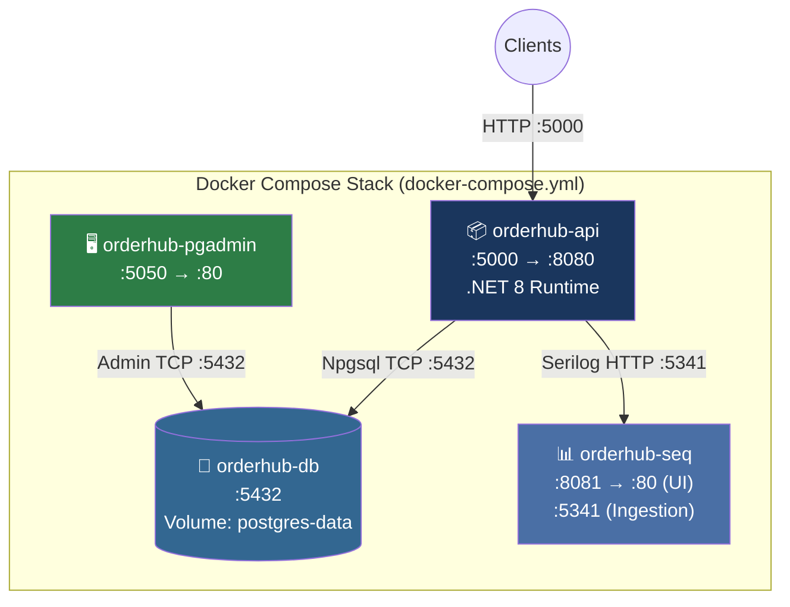

# Deployment Guide

This guide details the containerized deployment setup for OrderHub, covering service configurations, database migrations, and operational guidelines.

---

## 1. Single-Host Docker Compose Architecture

For local development and staging environments, OrderHub uses **Docker Compose** to coordinate 4 containers connected via a private bridge network (`orderhub-net`).


```mermaid
graph TB
    subgraph "Docker Compose Stack (docker-compose.yml)"
        API["📦 orderhub-api<br/>:5000 → :8080<br/>.NET 8 Runtime"]
        DB[("🐘 orderhub-db<br/>:5432<br/>Volume: postgres-data")]
        PGA["🖥️ orderhub-pgadmin<br/>:5050 → :80"]
        SEQ["📊 orderhub-seq<br/>:8081 → :80 (UI)<br/>:5341 (Ingestion)"]
    end

    Client((Clients)) -->|HTTP :5000| API
    API -->|Npgsql TCP :5432| DB
    API -->|Serilog HTTP :5341| SEQ
    PGA -->|Admin TCP :5432| DB

    style API fill:#1a365d,color:#fff
    style DB fill:#336791,color:#fff
    style SEQ fill:#4a6fa5,color:#fff
    style PGA fill:#2d7d46,color:#fff
```

---

## 2. Environment Configuration

The container stack reads environment configurations from the `.env` file located in the solution root.

### Required Environment Variables

| Variable | Description | Example |
|---|---|---|
| **`POSTGRES_DB`** | Target PostgreSQL database name. | `orderhub` |
| **`POSTGRES_USER`** | PostgreSQL database administrator username. | `orderhub` |
| **`POSTGRES_PASSWORD`** | PostgreSQL database administrator password. | *Use a strong password* |
| **`PGADMIN_DEFAULT_EMAIL`** | Login email for the pgAdmin console. | `admin@orderhub.dev` |
| **`PGADMIN_DEFAULT_PASSWORD`**| Login password for the pgAdmin console. | *Use a strong password* |
| **`JWT_KEY`** | Cryptographic secret key used to sign JWT access tokens (minimum 32 characters). | *Use a strong base64-encoded string* |

### Generating a Strong JWT Key
You can generate a base64-encoded key using the following PowerShell command:
```powershell
[Convert]::ToBase64String((1..48 | ForEach-Object { Get-Random -Maximum 256 }) -as [byte[]])
```

---

## 3. Autonomic Startup Migrations & Seeding

On startup, the `orderhub-api` container automatically executes database schema updates before accepting external HTTP requests:
1.  **Runs Migrations:** Applies any pending database schema migrations.
2.  **Registers Extensions:** Registers the `pg_trgm` PostgreSQL extension.
3.  **Seeds Catalog Data:** Generates the default Admin and Customer accounts, and seeds **10,000 product records** in batches of 2,000 to prevent startup memory spikes.

---

## 4. Common Operations

### Start the Stack
```bash
docker-compose up --build -d
```

### View Application Logs
```bash
# Follow all container logs
docker-compose logs -f

# Follow API container logs only
docker-compose logs -f orderhub-api
```

### Reset the Database
This deletes the persistent database volume, forcing a fresh migration and seed run on the next start:
```bash
docker-compose down -v
docker-compose up --build -d
```

---

## 5. Production Topology Recommendations

To scale OrderHub for production environments, update the infrastructure topology:

1.  **SSL/TLS Termination:** Configure a reverse proxy (e.g., Nginx, Traefik, or AWS ALB) to handle HTTPS certificates at the network edge and forward cleaned traffic to Kestrel over HTTP.
2.  **Horizontal Scaling:** Run multiple stateless instances of the API container behind a load balancer to ensure high availability.
3.  **Distributed Caching:** Replace `IMemoryCache` with a distributed cache (such as Redis) or `.NET 9`'s `HybridCache` to maintain cache consistency across multiple API nodes.
4.  **Telemetry Collection:** Deploy the OpenTelemetry Collector to ingest structured logs and trace metrics, exporting them to Jaeger or Prometheus.
