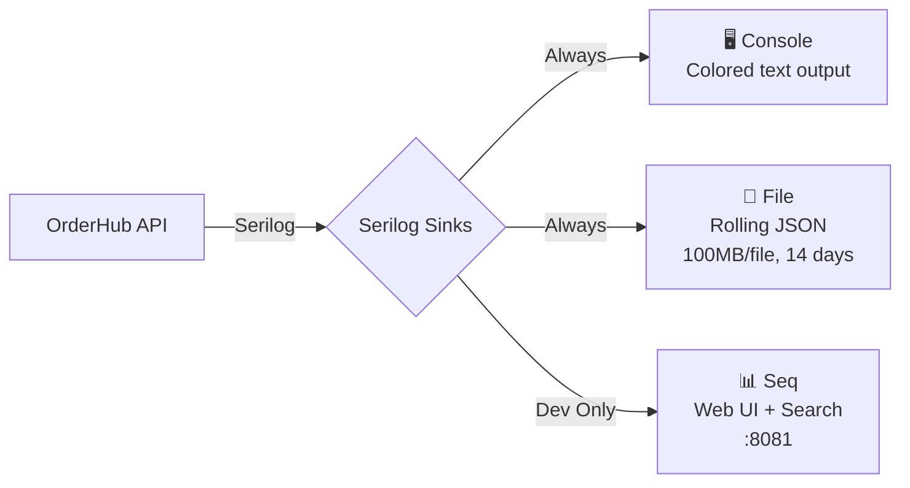
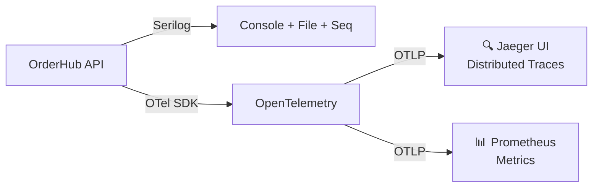

# Observability Guide

## Logging Architecture

OrderHub uses **Serilog** for structured logging with multiple output sinks:

## Serilog Configuration

### Enrichers

Every log event is enriched with contextual information:

| Enricher | Adds | Use Case |
|----------|------|----------|
| `FromLogContext` | Request-scoped properties | Correlate logs within a request |
| `MachineName` | Server hostname | Identify which server produced the log |
| `EnvironmentName` | Dev / Staging / Production | Filter by environment |
| `ProcessId` | OS process ID | Diagnose process-level issues |
| `ThreadId` | Managed thread ID | Trace concurrent execution |
| `Serilog.Enrichers.Span` | TraceId + SpanId | OpenTelemetry correlation (ready, not active yet) |
| `ExceptionDetails` | Destructured exception data | Rich exception information |

### Output Formats

| Sink | Format | Example |
|------|--------|---------|
| Console | Colored structured text | `[INF] HTTP POST /api/v1/orders responded 201 in 45ms` |
| File | JSON (rolling) | `{"@t":"2025-06-15T14:30:00Z","@mt":"HTTP {Method} {Path} responded {StatusCode}","Method":"POST","Path":"/api/v1/orders","StatusCode":201,"Elapsed":45}` |
| Seq | Structured events | Searchable via Seq Web UI at `http://localhost:8081` |

## Using Seq (Development)

Seq provides a web-based log search and visualization interface:

1. Start the stack: `docker-compose up -d`
2. Open Seq: `http://localhost:8081`
3. Search examples:
   - `@Level = "Error"` — all errors
   - `Path LIKE "/api/v1/orders%"` — order-related requests
   - `StatusCode = 409` — stock conflicts
   - `Elapsed > 1000` — slow requests (>1 second)

## Sensitive Data Protection

### SensitiveDataDestructuringPolicy

Automatically redacts known sensitive fields from log events:

- JWT tokens → `[REDACTED]`
- Password fields → `[REDACTED]`
- Email addresses → Partially masked

### SensitiveLogEventFilter

A second layer of protection that filters sensitive properties before they reach any sink. This ensures:

- No passwords appear in any log output
- No JWT tokens are written to files
- No PII leaks to Seq or console

## What Gets Logged

| Event | Level | Example |
|-------|-------|---------|
| Request processed | Information | `HTTP POST /api/v1/orders responded 201 in 45ms` |
| Validation failure | Warning | `Validation failed for CreateOrderCommand` |
| Business rule violation | Warning | `Insufficient stock for product X` |
| Unhandled exception | Error | `Unexpected error processing request` |
| Cache invalidation | Debug | `Invalidated products cache version` |
| Database migration | Information | `Applied migration: InitialCreate` |

## Planned: OpenTelemetry + Jaeger

The next observability step (from GOALS.md):

1. **OpenTelemetry SDK** — Add .NET OTel instrumentation for traces and metrics
2. **Jaeger** — Deploy Jaeger container for distributed trace visualization via OTLP
3. **Correlation** — Link Serilog `TraceId`/`SpanId` (already enriched) with OTel traces

