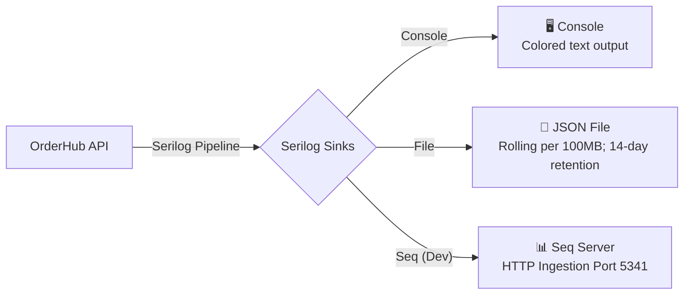
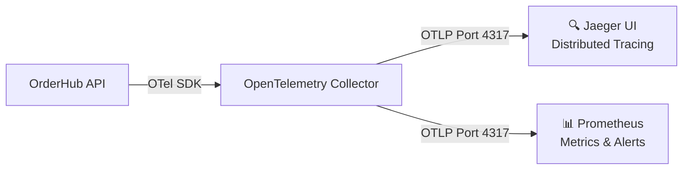

# Observability Guide

OrderHub implements a structured logging and telemetry pipeline designed to give developers and operations teams deep visibility into system execution, performance, and failure states.

---

## 1. Logging Architecture

OrderHub uses **Serilog** for structured logging, generating machine-readable JSON log streams. Logs are dispatched asynchronously to three distinct output sinks:


```mermaid
graph LR
    APP["OrderHub API"] -->|"Serilog Pipeline"| Sinks{"Serilog Sinks"}
    Sinks -->|"Console"| CON["🖥️ Console<br/>Colored text output"]
    Sinks -->|"File"| FILE["📄 JSON File<br/>Rolling per 100MB; 14-day retention"]
    Sinks -->|"Seq (Dev)"| SEQ["📊 Seq Server<br/>HTTP Ingestion Port 5341"]
```

*   **Console Sink:** Outputs colored, human-readable structured text to stdout.
*   **JSON File Sink:** Outputs rolling JSON logs to disk, configured with a 100MB file size limit and a 14-day retention window.
*   **Seq Sink (Development):** Dispatches structured events to the Seq log explorer for interactive search and query analysis.

---

## 2. Correlation ID Propagation

To trace request execution flows across multiple async tasks, database queries, and system boundaries, OrderHub uses a correlation ID middleware (`CorrelationIdMiddleware`):

1.  **Extraction:** Scans incoming HTTP request headers for an `X-Correlation-ID` header. If absent, it generates a new GUID.
2.  **Injection:** Injects the correlation ID into the HTTP response headers and pushes the value into Serilog's `LogContext`.
3.  **Output:** Every log entry generated during the lifecycle of the request includes the `CorrelationId` property, allowing developers to trace request execution end-to-end.

---

## 3. Telemetry and Log Redaction

To prevent Personally Identifiable Information (PII) or credentials from leaking into log storage, the infrastructure layer implements a strict redaction policy:

### 1. `SensitiveDataDestructuringPolicy`
Intercepts complex objects passed to log statements, redacting properties like passwords, JWT access tokens, and refresh tokens:
*   Matches sensitive properties (e.g., `Password`, `Token`, `AccessToken`, `RefreshToken`).
*   Replaces values with `[REDACTED]`.
*   Email addresses are partially masked (e.g., `c***r@orderhub.com`).

### 2. `SensitiveLogEventFilter`
Acts as a second layer of protection, filtering log events before they reach the sinks to ensure no sensitive parameters or auth headers leak into log files or console outputs.

---

## 4. Querying Logs in Seq

Start the container stack and open the Seq UI at `http://localhost:8081` to search and filter logs:

*   **Filter Errors:**
    ```sql
    @Level = 'Error'
    ```
*   **Trace Request Lifecycles:**
    Search for a specific correlation ID to view all logs generated by that request:
    ```sql
    CorrelationId = 'a1b2c3d4-e5f6-7a8b-9c0d-1e2f3a4b5c6d'
    ```
*   **Find Performance Bottlenecks:**
    Find endpoints with response latencies exceeding 500ms:
    ```sql
    Elapsed > 500
    ```
*   **Find Order Cancellations:**
    ```sql
    @MessageTemplate like '%cancell%'
    ```

---

## 5. Tracing Roadmap: OpenTelemetry & Jaeger

The next phase of the observability roadmap introduces distributed tracing using OpenTelemetry:


```mermaid
graph LR
    API["OrderHub API"] -->|"OTel SDK"| Collector["OpenTelemetry Collector"]
    Collector -->|"OTLP Port 4317"| Jaeger["🔍 Jaeger UI<br/>Distributed Tracing"]
    Collector -->|"OTLP Port 4317"| Prometheus["📊 Prometheus<br/>Metrics & Alerts"]
```

1.  **OpenTelemetry SDK:** Add .NET OTel instrumentation for traces, database queries, and custom business metrics.
2.  **Jaeger integration:** Deploy Jaeger to visualize trace spans, execution flows, and database query latency.
3.  **Correlation Link:** Bind Serilog `TraceId`/`SpanId` enrichers with OpenTelemetry traces to link log entries with visual trace charts.
